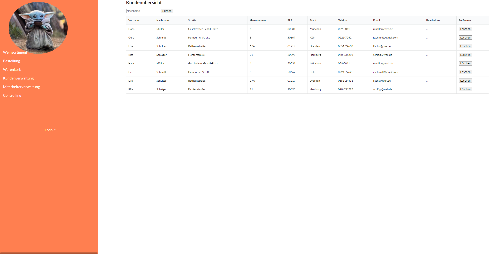
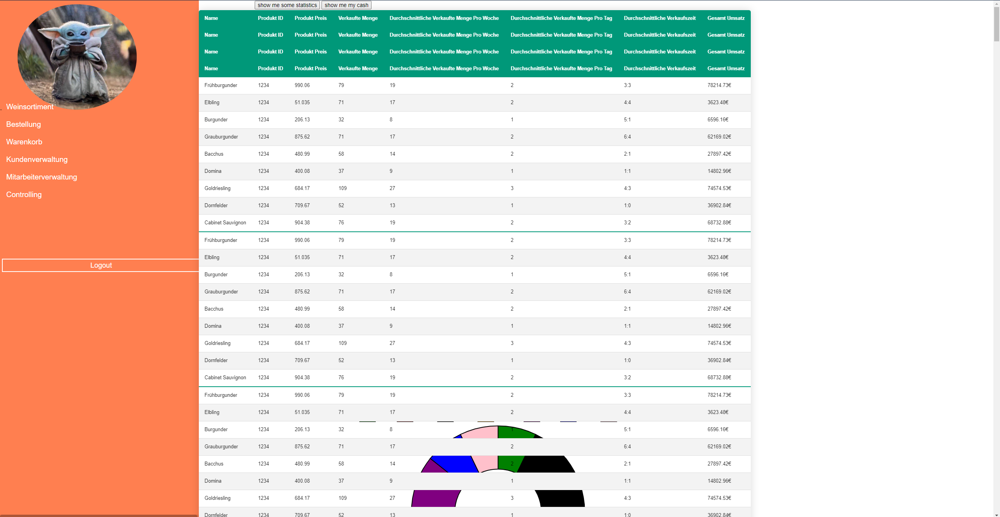
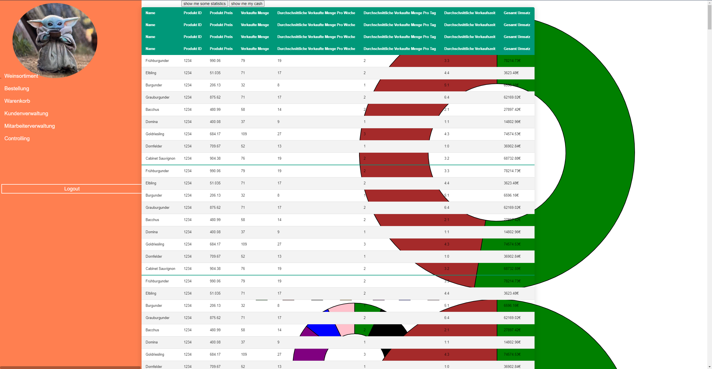
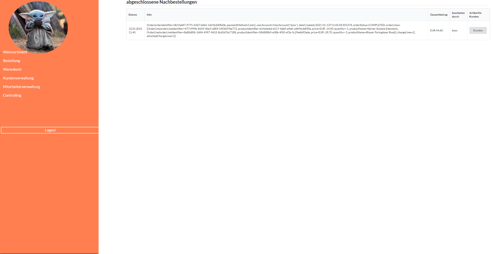
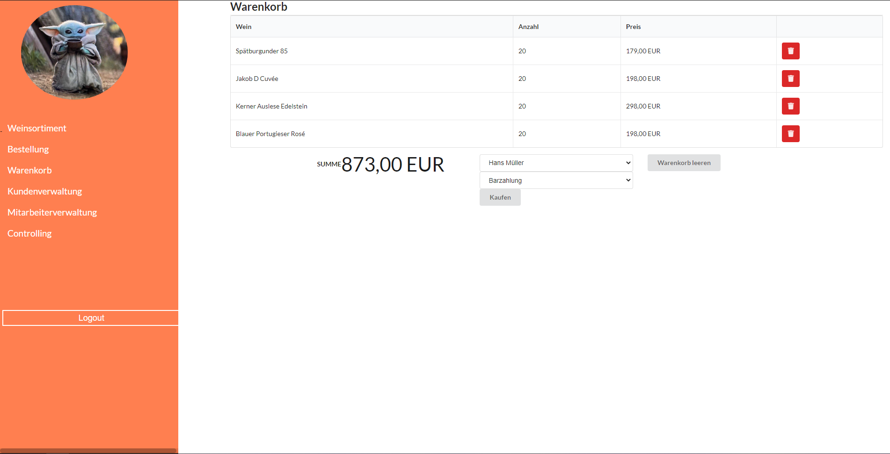
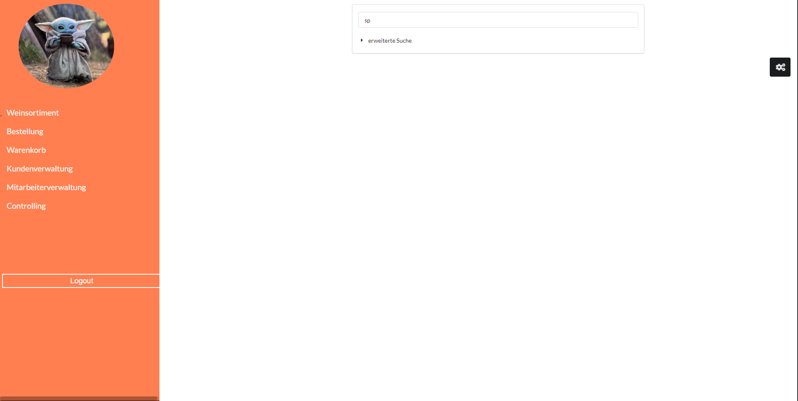
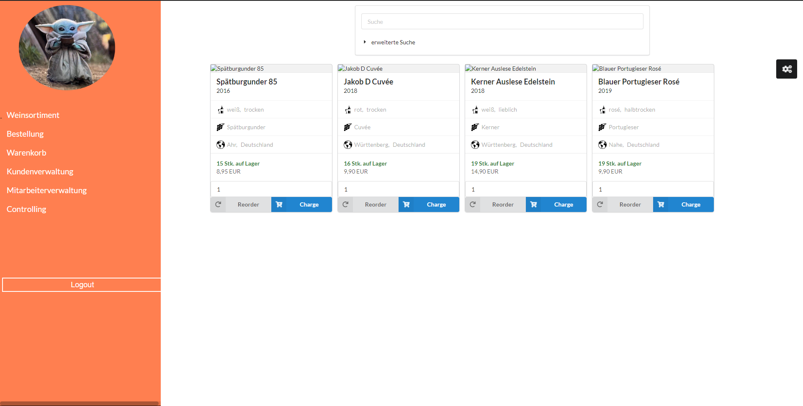
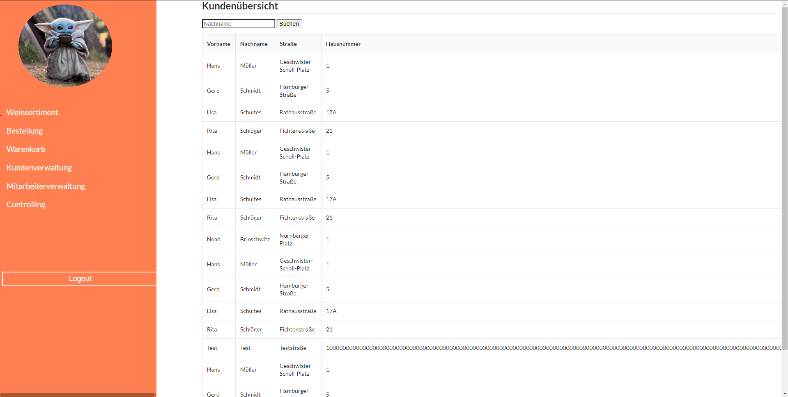

= Cross-Testing Feedback

__Durchführende Gruppe:__ 37

__Anwendung von Gruppe:__ 38

== Getestetes System

Die Anwendung ist ein IT-System für die Vinothek „La Bouteille“, das für Katalogverwaltung, Lager und Nachbestellwesen, 
Kundenstammverwaltung, Auftragserfassung und Rechnungsstellung, Bestellung derzeit nicht vorrätiger Weine und
Bilanzierung verwendet werden soll.

== Fehler-Report
// See http://asciidoctor.org/docs/user-manual/#tables

[frame="all"]
|===
|*Pfad* |*Parameter* |*Beschreibung* |*Rückgabe* |*Anhang*
|Kundenverwaltung / Kundenübersicht |keine |Die "Default Customer" werden mit jedem Start der Anwendung dupliziert |Duplikate der der "Default Customer" |1
|Controlling / Finanzübersicht |Click auf "Show me some statistics" oder "Show me my cash"  |Diagramme werden mit jedem Click ein weiteres Mal angezeigt |So viele Diagramme wie Clicks |2
|Controlling / Finanzübersicht |Click auf "Show me some statistics" oder "Show me my cash" |Bei abwechselnden Clicks auf "Show me some statistics" oder "Show me my Cash" überlappen sich die Diagramme |Überlappende Diagramme |3
|Bestellung / offene bzw. abgeschlossene Nachbestellungen / Info |angelegte bzw. abgeschlossene Nachbestellung |In der Spalte "Info" wird Kauderwelsch angezeigt |Nicht aufbereitete Daten der Nachbestellung |4
|Warenkorb /Kundenbestellung     |Weine 20 mal hinzufügen und dann auf Kaufen klicken     |Whitelabel Error Page     |Whitelabel Error Page      |5 & 6
|Controlling /Inventur      |Es passiert nichts     |Es passiert nichts, also man wird nicht weitergeleitet     |-     |-
|Weinsortiment /Suchen     |spätburgunder     |Wenn man nach einem Wein sucht und den Anfangsbuchstaben klein schreibt findet er nichts mehr   |-     |7
|Weinsortiment     |-     |Bilder werden nicht angezeigt    |-      |8
|Kundenverwaltung /Kunden Übersicht     |Wenn man einen neuen Kunden anlegt und in die Hausnummer extrem viele Zahlen eingibt    |Die Zahl ist so groß, dass alles andere rechts daneben nicht mehr angezeigt wird, dass Problem ist das man den Kunden dann auch nicht mehr löschen kann, weil der Lösch Knopf ganz rechts ist    |zu lange Zahl, sodass man den Rest nicht mehr erkennen kann      |9
|Startseite |- |Menüleiste ragt bei höhen Bildschirmauflösungen in Baby Yoda-Bild |- |10

|===

=== Anhang

Anhang 1: 
Anhang 2: 
Anhang 3: 
Anhang 4: 
Anhang 5: 
Anhang 6: 
Anhang 7: 
Anhang 8: 
Anhang 9: 
Anhang 10: 

== Sonstiges
* Optik der Anwendung

->Dropdown Menü etwas sehr verschoben (nicht links zentriert)

->Scrollbalken nach Links und Rechts bei dem Linken Menü nicht unbedingt schön

->Rechnung sieht sehr schön aus

->Überschriften der Seiten sollten etwas nach unten gesetzt werdem, damit sie nicht direkt am oberen Bildrand hängen

* Fehlende Features

Inventur ist noch nicht zugänglich

* Interaktion mit der Anwendung (Usability)

Keine großen Beschwerden

== Verbesserungsvorschläge
* Was kann noch weiter verbessert werden?

-> Dropdown Menü etwas sehr anstrengend zum bedienen, weil sobald man mit dem Cursor zu weit rechts ist um das Menü auszuklappen und ein Unterpunkt auszuwählen, passiert
es sehr oft, dass das Menü wieder zu geht

