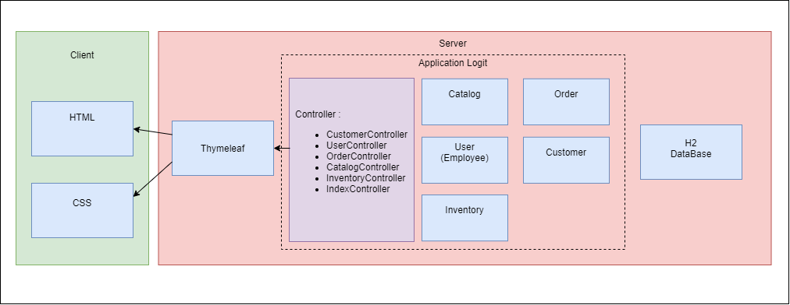
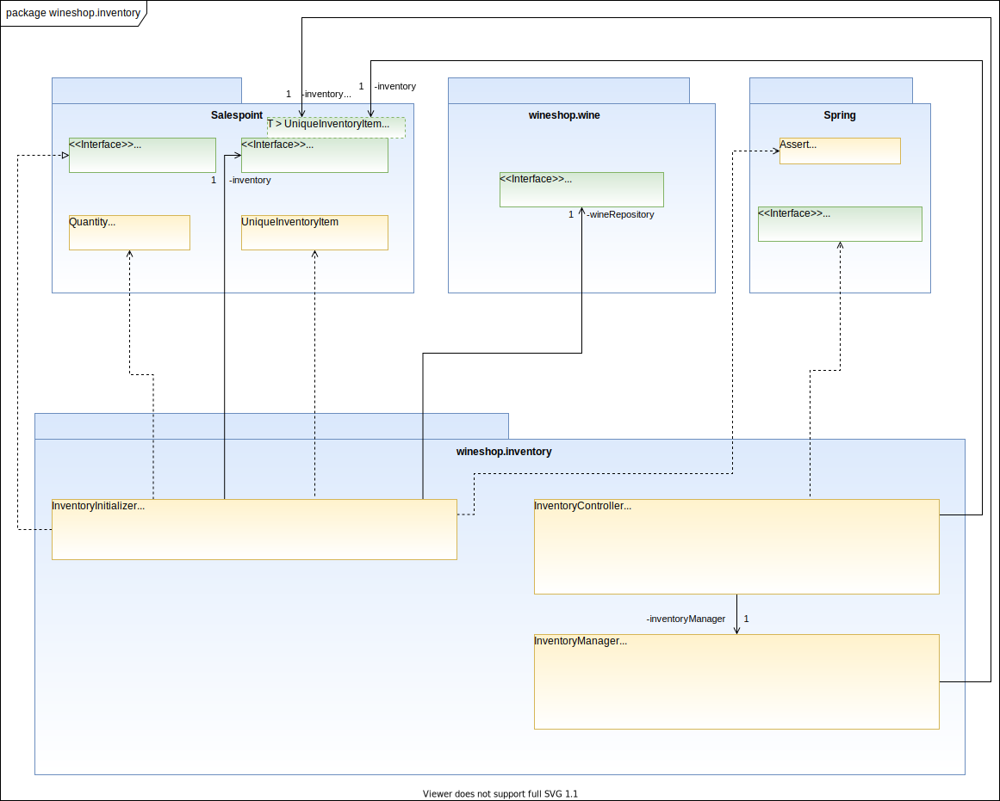
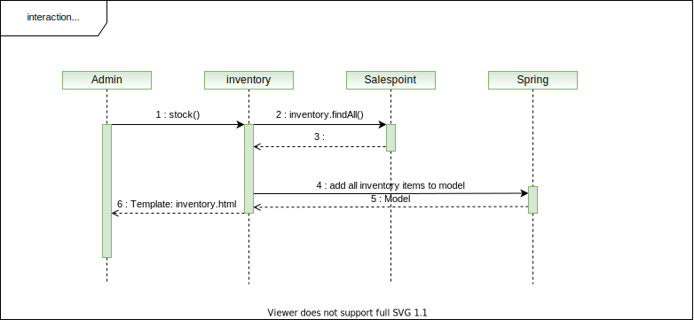
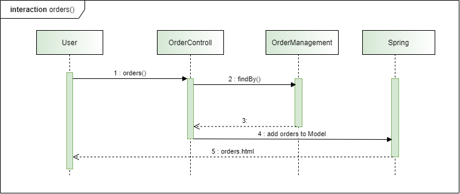

[options="header"]
[cols="1, 3, 3"]
|===
|Version | Bearbeitungsdatum   | Autor 
|0.1	| 25.11.2020 | Henrik
|0.2	| 26.11.2020 | Kim
|0.3  | 27.11.2020 | Tom
|0.4  | 28.11.2020 | Henrik
|0.5   | 30.11.2020 | Noah
|0.5687v1|30.11.2020|Lavon
|===

= Entwicklerdokumentation

== 1 Einführung und Ziele

=== 1.1 Aufgabestellung

Unsere Vinothek (_WineShop_) hat zwei Typen von Benutzer:innen (_User_): Angestellte (_EMPLOYEE_) und Chef (_ADMIN_) mit unterschiedlichen Verantwortlichkeiten.

Jede Benutzer:in darf auf den Katalog (_WineCatalog_) zugreifen, allerdings dürfen Angestellten keine Änderungen daran vornehmen (_editProductInCatalog_). Der Katalog beinhaltet Informationen über alle Produkte (_Wine_) des Weingeschäfts. Jeder Weinsorte wird ein Bild (_pic_) zugeordnet mit zahlreichen Informationen, wie z.B. Produkt-ID (_productId_), Artikelnummer (_itemNr_), Name (_name_), Sorte (_type_), Einkaufspreis (_buyPrice_), Verkaufspreis (_sellPrice_) und Beschreibung (_details_).

Jede Kund:in  (_Customer_) besitzt genau ein Konto in unserem System. Unter diesem Konto werden folgende Kundedaten gespeichert: Kunden-ID (_customerID_), Vorname (_forename_), Zuname (_surname_), Geburtsdatum (_dob_), E-Mail-Adresse (_email_). Kund:in darf zum Zeitpunkt der Kontoerstellung nicht minderjährig (_notUnderage_) sein.

Unsere Kund:innen werden in der nächsten Zukunft keinen Zugang zu unserem Shop haben, Einkäufe werden von Angestellten erfasst, sowie die Registrierung wird auch von Angestellten durchgeführt. Im Shopping-Modus bei jeder Ware im Katalog erscheinen 10 Weingläser, mit deren Hilfe man 1 bis 10 Weinflaschen zum Warenkorb hinzufügen kann (_addToBasket_). Jede Ware kann zum Warenkorb hinzugefügt werden, egal ob sie vorhanden ist oder nicht.

Im Warenkorb-Modus kann die Anzahl jeder Ware geändert werden (_edit_), jede einzelne Ware (_remove_) bzw. der gesamte Warenkorb (_empty_) können gelöscht werden. Der Warenkorb besteht aus zwei Teilen, links sind die Artikel, die vorhanden sind und als Bestellung (_Order_) erfasst werden, rechts sind die nicht vorhandenen Waren, die als Vorbestellung (_Preorder_) interpretiert werden. 

Wenn die Kund:in fertig mit dem Einkaufen ist, klickt die Verkäufer:in auf "Zur Kasse gehen"(_buy_). Im neuen Fenster wird die Kund:in in der Kundenliste ausgewählt(_listOfCustomers_). Falls die Kund:in nicht in der Datenbank ist, wird sie/er in die Datenbank eingetragen (_addCustomer_). Die möglichen Zahlungsarten (_paymentMethod_) sind Bargeld (_cash_) oder Kreditkarte (_creditCard_). Danach klickt man auf "Bezahlt" (_Orders.add_). 

Falls eine Bestellung aus nicht vorhandenen Waren besteht (_Order.status: opened_), ist die fehlende Ware nachzubestellen (_reorder_). Die Kund:in wird per E-Mail informiert, sobald die Ware eingetroffen ist (_Order.status: CLOSED_).

Unsere Produkte werden im Weinlager (_Inventory_) aufbewahrt. Jeder Weinsorte (_InventoryItem_) wird die Anzahl (_quantity_) und der Status (_reordering_) zugespeichert. Jede Weinsorte kann nachbestellt (_reorder_) werden. Es darf pro Weinsorte gleichzeitig maximal eine Nachbestellung laufen.

Admin, außer allen oben aufgeführten Verantwortlichkeiten, kann Produkte im Katalog erstellen, bearbeiten und löschen. Er hat den Zugang zur Bilanzierung und kann die Angestelltenliste bearbeiten.

=== Qualitätsziele

== 2 Randbedingungen
=== 2.1 Hardware-Vorgaben

Eine Liste mit benötigter Hardware, um mit der Software interagieren zu können.

* Computer
* Tastatur
* Maus

=== 2.2 Software-Vorgaben
Eine Liste mit benötigter Software, um mit der Software interagieren zu können.

Diese oder eine neuere Version von Java wird benötigt:

* Java 11

Diese oder eine neuere Version der aufgelisteten Browser wird benötigt:

* Mozilla Firefox Version 82.0.3
* Google Chrome Version 86.0.4240.198

=== 2.3 Vorgaben zum Betrieb des Software

Hier wird ein Überblick darüber gegen, wie die Software und in welchen Situation sie
genutzt werden sollte. 

Das Produkt (die Software) wird als Verkaufssoftware ausschließlich firmenintern (lokal auf den Computern laufend) in der Vinothek „La Bouteille“ benutzt werden. Dabei wird ein Mitarbeiter, die Software bedienend, den Kunden durch den Kaufprozess begleiten. Die Software wird dabei über einen Browser bedient, jedoch soll sie nicht für Benutzer außerhalb des lokalen Netzwerkes zugänglich sein.

Die Software wird hauptsächlich von den Mitarbeitern sowie der Geschäftsführung der "La Bouteille" bedient, welche nicht zwingend mit dem technischen Hintergrund der Software vertraut sind. Die Software soll daher keine technische Wartung benötigen.

Die Daten sollen dauerhaft in einer lokalen Datenbank gespeichert werden und durch die Software erreichbar sein.

== 3 Kontextabgrenzung
=== 3.1 Kontextdiagramm
image:./images/Vinothek_Context.png[context diagram]

== 4 Lösungsstrategie

=== 4.1 Erfüllung der Qualitätsziele
_Die folgende Tabelle zeigt die zuvor definierten Qualitätsanforderungen und Lösungsansätze, um diese zu erfüllen._

[options="header"]
|=== 
|Qualitätsziel|Lösungsansatz
|Wartbarkeit a|
* *Modularität* Die Anwendung wird aus disktreten Komponenten zusammengestellt, so dass Änderungen an einer Kompente möglichst wenige Auswirkungen auf andere Komponenten haben.
* *Wiederverwendbarkeit* Es wird sichergestellt, dass die Systemkomponenten von anderen Komponenten oder System wiederverwendet werden können.
* *Modifizierbarkeit* Es wird sichergestellt, dass die Anwendung geändert oder erweitert werden kann, ohne dass Fehler auftreten oder die Produktqualität beeinträchtigt wird.
|Benutzerfreundlichkeit a|
* *Erlernbarkeit* Es wird sichergestellt, dass das System von seinen Benutzern leicht verwendet und verstanden werden kann.
* *Benutzerfehlerschutz / Fehlerbehandlung* Der Benutzer muss vor Fehlern geschützt werden. Deshalb dürfen ungültige Eingaben nicht zu ungültigen Systemzuständen führen.
* *Ästhetik der Benutzeroberfläche* Dem Benutzer wird eine angenehme und zufriedenstellende Benutzeroberfläche bereitgestellt.
* *Zugänglichkeit* Es wird sichergestellt, dass möglichst viele Personen das System vollständig nutzen können. Dies wird durch die Wahl von geeigneten Schriftgrößen und Farbkontrasten sichergestellt.
|Sicherheit a|
* *Vetraulichkeit* Es wird sichergestellt, dass nur zum Zugriff berechtigte Personen auf Daten zugreifen können. Dies geschieht durch Benutzung von _Spring Security_ und _Thymeleaf_ (`sec:authorize` - Tag).
* *Integrität* Unbefugte Änderungen von Daten werden verhindert. Realisiert wird dies mit _Spring Security_-Annotationen (`@PreAuthorize`).
* *Verantwortlichkeit* Jede Handlung oder jedes Ereignis kann auf eine eindeutige Entität oder Person rückverfolgt werden. In dieser Anwendung ist jede "Order" mit einem "Customer" verknüpft.
|===

=== 4.2 Softwarearchitektur

_Top-Level-Architektur der Anwendung_

_Client-Server-Modell der Anwendung. Der Client enthält nur HTML- und CSS-Dateien. Die Anwendungslogik ist auf dem Server implementiert._

HTML-Vorlagen werden clientseitig mit den entsprechenden CSS-Stylesheets gerendert. Die in den Templates angezeigten Daten werden von Thymeleaf bereitgestellt. Thymeleaf empfängt die angeforderten Daten von den Controller-Klassen, die im Backend implementiert sind. Diese Controller-Klassen verwenden dagegen Instanzen und Methoden der Modellklassen. Standardmäßig speichert eine zugrundeliegende H2-Datenbank Daten dauerhaft.

=== 4.3 Architekturentscheidungen
==== 4.3.1 Designmuster
* Spring MVC

==== 4.3.2 Persistenz
Die Anwendung verwendet die auf Annotationen basierende Zuordnung im Ruhezustand, um Java-Klassen Datenbanktabellen zuzuordnen. Als Datenbank wird H2 verwendet. Die Persistenz ist standardmäßig deaktiviert. Um den Persistenzspeicher zu aktivieren, müssen die folgenden zwei Zeilen in der Datei application.properties nicht kommentiert werden:
....
# spring.datasource.url=jdbc:h2:./db/wineshop
# spring.jpa.hibernate.ddl-auto=update
....
==== 4.3.3 User Interface

=== 4.4 Verwendung externer Frameworks
[options="header"]
|===
|Externes Paket |Wird verwendet von (Anwendungsklasse)
|salespointframework.catalog a|
* wineshop.wine.Wine
* wineshop.wine.WineRepository
* wineshop.order.OrderController
|salespointframework.core a|
* wineshop.wine.WineDataInitializer
* wineshop.customer.CustomerDataInitializer
* wineshop.user.UserDataInitializer
|salespointframework.inventory a|
* wineshop.wine.WineController
* wineshop.inventory.InventoryController
* wineshop.inventory.InventoryInitializer
|salespointframework.order | wineshop.order.OrderController
|salespointframework.payment | wineshop.order.OrderController
|salespointframework.quantity a|
* wineshop.wine.WineController
* wineshop.inventory.InventoryInitializer
* wineshop.order.OrderController
|salespointframework.SalespointSecurityConfiguration |wineshop.wineshop.Application
|salespointframework.time | wineshop.wine.WineController
|salespointframework.useraccount a|
* wineshop.customer.Customer
* wineshop.customer.CustomerDataInitializer
* wineshop.customer.CustomerManagement
* wineshop.user.User
* wineshop.user.UserDataInitializer
* wineshop.user.UserManagement
* wineshop.order.OrderController
|springframework.boot |wineshop.Application
|springframework.data a|
* wineshop.wine.WineRepository
* wineshop.customer.CustomerManager
* wineshop.customer.CustomerRepository
* wineshop.user.UserManager
* wineshop.user.UserRepository
|springframework.security | wineshop.wineshop.Application
|springframework.ui a|
* wineshop.wine.WineController
* wineshop.customer.CustomerController
* wineshop.user.UserController
* wineshop.inventory.InventoryController
* wineshop.order.OrderController
|springframework.util a|
* wineshop.customer.CustomerController
* wineshop.customer.CustomerDataInitializer
* wineshop.user.UserController
* wineshop.user.UserDataInitializer
* wineshop.order.OrderController
|springframework.validation a|
* wineshop.customer.CustomerController
* wineshop.user.UserController
|springframework.web |wineshop.wineshop.Application
|===

== 5 Bausteinsicht

=== 5.1 Wineshop

=== 5.2 Katalog
image:models/analysis/catalog_architecture.svg[class design diagram - catalog]

[options="header"]
|===
|Klasse/Enumeration |Beschreibung
|Wine |Benutzerdefinierte Klasse um Wein genauer zu definieren
|Winetype|Enumeration um dem Wein den passenden typen zu verteilen
|CatalogController |Eine Spring MVC Contoller Anwendung um Anfragen vom Wein zu bearbeiten und schließlich zu zeigen
|WineDataInitializer |Eine Methode um dummys zu erstellen
|CatalogManager |Den Manager benötigen wir um unsere Produkte zu bearbeiten
|WineCatalog |Eine Schnittstelle um den Dummys die benötigte Information zu geben
|NewProductForm |Eine Klasse die die Form angibt was der Wein alles für Informationen braucht um sie schließlich wiederzugeben
|===

=== 5.3 Customer

image:models/analysis/customer.svg[class design diagram - customer]

[options="header"]
|=== 
|Klasse/Enumeration |Beschreibung
|Customer |Benutzerdefinierte Klasse zum Erweitern des Salespoint-UserAccount um eine Adresse
|CustomerController |Ein Spring MVC-Controller zur Bearbeitung von Anfragen zur Registrierung, Anzeige und Bearbeitung von Kundendaten
|CustomerDataInitializer |Eine Implementierung des DataInitializer zum Erstellen von Dummy-Kunden beim Start der Anwendung
|CustomerManager |Serviceklasse zur Kundenverwaltung
|CustomerRepository |Eine Repository-Schnittstelle zum Verwalten von Kundeninstanzen
|CustomerRegistrationForm |Eine Klasse zur Validierung der Benutzereingaben des Registrierungsformulars für Kunden
|===

=== 5.4 Inventory

[options="header"]
|===
|Klasse/Enumeration |Beschreibung
|InventoryController |Spring MVC Controller, welcher die Anfrage zum Anzeigen des Lagerbestandes bearbeitet.
|InventoryInitializer |Eine Implementierung des DataInitializer zum Erstellen von Dummy-Lagergegenständen beim Start der Anwendung
|===

=== 5.5 Order
image:models/analysis/order.svg[class design diagram - order]

[options="header"]
|=== 
|Class/Enumeration |Description
|OrderController|Spring MVC Controller, welcher Anfragen für die Bestellungen und das Kart bearbeitet.
|===

=== 5.6 User

image:models/analysis/user.svg[class design diagram - user]

[options="header"]
|=== 
|Klasse/Enumeration |Beschreibung
|User |Benutzerdefinierte Klasse zum Erweitern des Salespoint-UserAccount um einen Benutzernamen
|UserController |Ein Spring MVC-Controller zur Bearbeitung von Anfragen zur Registrierung, Anzeige und Bearbeitung von Mitarbeiterdaten
|UserDataInitializer |Eine Implementierung des DataInitializer zum Erstellen von Dummy-Mitarbeitern beim Start der Anwendung
|UserManager |Serviceklasse zur Mitarbeiterverwaltung
|UserRepository |Eine Repository-Schnittstelle zum Verwalten von Mitarbeiterinstanzen
|UserRegistrationForm |Eine Klasse zur Validierung der Benutzereingaben des Registrierungsformulars für Mitarbeiter
|===

=== 5.7 Rückverfolgbarkeit zwischen Analyse- und Entwurfsmodell
_Die folgende Tabelle zeigt die Rückverfolgbarkeit zwischen Entwurfs- und Analysemodell. Falls eine Klasse aus einem externen Framework im Entwurfsmodell eine Klasse des Analysemodells ersetzt,
wird die Art der Verwendung dieser externen Klasse in der Spalte *Art der Verwendung* mithilfe der folgenden Begriffe definiert:_

* Inheritance/Interface-Implementation
* Class Attribute
* Method Parameter

[options="header"]
|===
|Class/Enumeration (Analysis Model) |Class/Enumeration (Design Model) |Usage
|Wine                 |
						 wine.Wine |
|Cart                   |Salespoint.Cart | Method Parameter 
|CartItem               |Salespoint.CartItem (via Salespoint.Cart) | Method Parameter (via Salespoint.Cart)
|Inventory              |Salespoint.UniqueInventory a|
						* Class Attribute
						* Method Parameter
|InventoryItem          |Salespoint.UniqueInventoryItem | Method Parameter
|Order, PreOrder                  |Salespoint.Order | Method Parameter
|OrderLine              |Salespoint.Orderline (via Salespoint.Order) | Method Parameter (via Salespoint.Order)
|OrderManager           |Salespoint.OrderManager<Order> a|
						* Class Attribute
						* Method Parameter
|OrderStatus            |Salespoint.OrderStatus | Method Parameter
|ROLE/Role              |Salespoint.Role | Method Parameter
|User                   |Salespoint.UserAccount 
						a|
						* Class Attribute
						* Method Parameter
|Accounting             |Salespoint.Accountancy  |
|Customer             |customer.Customer  |    
|CustomerManager             |customer.CustomerManager  |   
|wineshop              |wineshop (whole package)  |
|===

== 6 Laufzeitsicht
* Darstellung der Komponenteninteraktion anhand eines Sequenzdiagramms, welches die relevantesten Interaktionen darstellt.

=== 6.1 Catalog
image:models/design/catalog_seq.svg[]

=== 6.2 Customer
image:models/design/seq_customer.svg[]

=== 6.3 Inventory

=== 6.4 Order

=== 6.5 User

image:models/design/seq_user.svg[]

== Technische Schulden
== 7 Technische Schulden
* Auflistung der nicht erreichten Quality Gates und der zugehörigen SonarQube Issues zum Zeitpunkt der Abgabe

