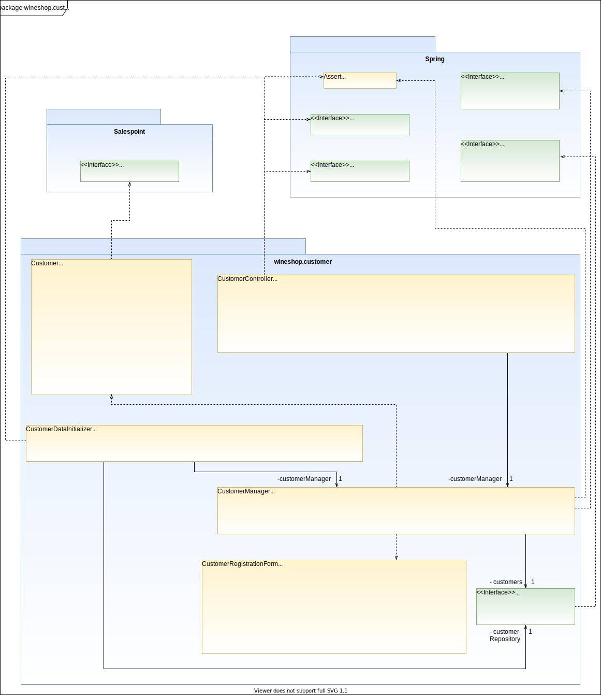

[options="header"]
[cols="1, 3, 3"]
|===
|Version | Bearbeitungsdatum   | Autor 
|0.1	| 25.11.2020 | Henrik
|===

= Entwicklerdokumentation

== Einführung und Ziele
* Aufgabenstellung
* Qualitätsziele

== Randbedingungen
* Hardware-Vorgaben
* Software-Vorgaben
* Vorgaben zum Betrieb des Software

== Kontextabgrenzung
* Kontextdiagramm

== Lösungsstrategie
=== Erfüllung der Qualitätsziele
_Die folgende Tabelle zeigt die zuvor definierten Qualitätsanforderungen und Lösungsansätze, um diese zu erfüllen._

[options="header"]
|=== 
|Qualitätsziel|Lösungsansatz
|Wartbarkeit a|
* *Modularität* Die Anwendung wird aus disktreten Komponenten zusammengestellt, so dass Änderungen an einer Kompente möglichst wenige Auswirkungen auf andere Komponenten haben.
* *Wiederverwendbarkeit* Es wird sichergestellt, dass die Systemkomponenten von anderen Komponenten oder System wiederverwendet werden können.
* *Modifizierbarkeit* Es wird sichergestellt, dass die Anwendung geändert oder erweitert werden kann, ohne dass Fehler auftreten oder die Produktqualität beeinträchtigt wird.
|Benutzerfreundlichkeit a|
* *Erlernbarkeit* Es wird sichergestellt, dass das System von seinen Benutzern leicht verwendet und verstanden werden kann.
* *Benutzerfehlerschutz / Fehlerbehandlung* Der Benutzer muss vor Fehlern geschützt werden. Deshalb dürfen ungültige Eingaben nicht zu ungültigen Systemzuständen führen.
* *Ästhetik der Benutzeroberfläche* Dem Benutzer wird eine angenehme und zufriedenstellende Benutzeroberfläche bereitgestellt.
* *Zugänglichkeit* Es wird sichergestellt, dass möglichst viele Personen das System vollständig nutzen können. Dies wird durch die Wahl von geeigneten Schriftgrößen und Farbkontrasten sichergestellt.
|Sicherheit a|
* *Vetraulichkeit* Es wird sichergestellt, dass nur zum Zugriff berechtigte Personen auf Daten zugreifen können. Dies geschieht durch Benutzung von _Spring Security_ und _Thymeleaf_ (`sec:authorize` - Tag).
* *Integrität* Unbefugte Änderungen von Daten werden verhindert. Realisiert wird dies mit _Spring Security_-Annotationen (`@PreAuthorize`).
* *Verantwortlichkeit* Jede Handlung oder jedes Ereignis kann auf eine eindeutige Entität oder Person rückverfolgt werden. In dieser Anwendung ist jede "Order" mit einem "Customer" verknüpft.
|===

=== Softwarearchitektur
* Beschreibung der Architektur anhand der Top-Level-Architektur oder eines Client-Server-Diagramms

=== Entwurfsentscheidungen
* Verwendete Muster
* Persistenz
* Benutzeroberfläche
* Verwendung externer Frameworks

[options="header", cols="1,2"]
|===
|Externes Package |Verwendet von (Klasse der eigenen Anwendung)
|... |... 
|===

== Bausteinsicht

=== Customer

[options="header"]
|=== 
|Klasse/Enumeration |Beschreibung
|Customer |Benutzerdefinierte Klasse zum Erweitern des Salespoint-UserAccount um eine Adresse
|CustomerController |Ein Spring MVC-Controller zur Bearbeitung von Anfragen zur Registrierung, Anzeige und Bearbeitung von Kundendaten
|CustomerDataInitializer |Eine Implementierung des DataInitializer zum Erstellen von Dummy-Kunden beim Start der Anwendung
|CustomerManager |Serviceklasse zur Kundenverwaltung
|CustomerRepository |Eine Repository-Schnittstelle zum Verwalten von Kundeninstanzen
|CustomerRegistrationForm |Eine Klasse zur Validierung der Benutzereingaben des Registrierungsformulars für Kunden
|===

=== User

image:models/analysis/user.svg[class design diagram - user]

[options="header"]
|=== 
|Klasse/Enumeration |Beschreibung
|User |Benutzerdefinierte Klasse zum Erweitern des Salespoint-UserAccount um einen Benutzernamen
|UserController |Ein Spring MVC-Controller zur Bearbeitung von Anfragen zur Registrierung, Anzeige und Bearbeitung von Mitarbeiterdaten
|UserDataInitializer |Eine Implementierung des DataInitializer zum Erstellen von Dummy-Mitarbeitern beim Start der Anwendung
|UserManager |Serviceklasse zur Mitarbeiterverwaltung
|UserRepository |Eine Repository-Schnittstelle zum Verwalten von Mitarbeiterinstanzen
|UserRegistrationForm |Eine Klasse zur Validierung der Benutzereingaben des Registrierungsformulars für Mitarbeiter
|===

* Entwurfsklassendiagramme der einzelnen Packages

[options="header"]
|=== 
|Klasse/Enumeration |Description
|...|...
|===

=== Rückverfolgbarkeit zwischen Analyse- und Entwurfsmodell
_Die folgende Tabelle zeigt die Rückverfolgbarkeit zwischen Entwurfs- und Analysemodell. Falls eine Klasse aus einem externen Framework im Entwurfsmodell eine Klasse des Analysemodells ersetzt,
wird die Art der Verwendung dieser externen Klasse in der Spalte *Art der Verwendung* mithilfe der folgenden Begriffe definiert:_

* Inheritance/Interface-Implementation
* Class Attribute
* Method Parameter

[options="header"]
|===
|Klasse/Enumeration (Analysemodell) |Klasse/Enumeration (Entwurfsmodell) |Art der Verwendung
|...|...|...
|===

== Laufzeitsicht
* Darstellung der Komponenteninteraktion anhand eines Sequenzdiagramms, welches die relevantesten Interaktionen darstellt.

== Technische Schulden
* Auflistung der nicht erreichten Quality Gates und der zugehörigen SonarQube Issues zum Zeitpunkt der Abgabe

