= Pflichtenheft __Vinothèque «La Bouteille»__

[options="header"]
[cols="1, 1, 1, 1, 4"]
|===
|Version | Status      | Bearbeitungsdatum   | Autor(en) |  Vermerk
|0.1     | In Arbeit   | 10.10.2020          | Autor       | Initiale Version
|0.2     | In Arbeit   | 11.11.2020          | Henrik, Lavon | Funktionale Anforderungen + Sequenzdiagramme hinzugefügt
|0.3     | In Arbeit   | 13.11.2020          | Kim | Systemgrenze und Top-Level-Architektur + Use-Cases
|0.4     | In Arbeit   | 13.11.2020          | Tom | Produktnutzung + Interessensgruppen (Stakeholders) hinzugefügt
|0.5     | In Arbeit   | 13.11.2020          | Noah |GUI + Akzeptanztestfälle
|0.6     | In Arbeit   | 14.11.2020          | David |Class Diagram
|0.7     | In Arbeit   | 14.11.2020          | Kim |Inhaltsverzeichnis + Die Ordnung korrigieren
|0.8     | In Arbeit   | 14.11.2020          | Henrik | Glossar hinzugefügt + Anforderungen den Anwendungsfällen zugeordnet + Anforderungen überarbeitet
|===

== 1.Inhaltsverzeichnis
=== 1.Inhaltsverzeichnis
=== 2.Zusammenfassung
=== 3.Aufgabenstellung und Zielsetzung
=== 4.Produktnutzung
=== 5.Interessensgruppen (Stakeholders)
=== 6.Systemgrenze und Top-Level-Architektur
===== 6.1.Kontextdiagramm
===== 6.2.Top-Level-Architektur
=== 7.Anwendungsfälle
===== 7.1.Akteure
===== 7.2.Überblick Anwendungsfalldiagramm
===== 7.3.Anwendungsfallbeschreibungen
=== 8.Funktionale Anforderungen
===== 8.1.Muss-Kriterien
===== 8.2.Kann-Kriterien
=== 9.Nicht-Funktionale Anforderungen
===== 9.1.Qualitätsziele
===== 9.2.Konkrete Nicht-Funktionale Anforderungen:
=== 10.GUI Prototyp
===== 10.1.Überblick: Dialoglandkarte
===== 10.2.Dialogbeschreibung
=== 11.Datenmodell
===== 11.1.Überblick: Klassendiagramm
===== 11.2.Klassen und Enumerationen
=== 12.Akzeptanztestfälle
=== 13.Glossar
=== 14.Offene Punkte

***
== 2.Zusammenfassung
Eine kurze Beschreibung des Dokuments. Wenige Absätze.

***
== 3.Aufgabenstellung und Zielsetzung

Unsere Vinothek (_WineShop_) hat zwei Typen von Benutzer:innen (_User_): Angestellte (_Employee_) und Chef (_Admin_) mit unterschiedlichen Verantwortlichkeiten.

Jede Benutzer:in darf auf den Katalog (_Catalog_) zugreifen, allerdings dürfen Angestellten keine Änderungen daran vornehmen. Der Katalog beinhaltet Informationen über alle Produkte (_Wine_) des Weingeschäfts. Jeder Weinsorte wird ein Bild (_pic_) zugeordnet mit zahlreichen Informationen, wie z.B. Artikelnummer (_itemNr_), Name (_name_), Sorte (_type_), Jahrgang (_vintage_), Herkunft (_origin_), Geschichte (_history_), Geschmack (_flavour_), Preis (_price_), verbleibende Anzahl im Lager (_bottles_left_).

Jede Kund:in  (_Customer_) besitzt genau ein Konto in unserem System. Unter diesem Konto werden folgende Kundedaten gespeichert: Kunden-ID (_customerID_), Vorname (_forename_), Zuname (_surname_), Geburtsdatum (_dob_), E-Mail-Adresse (_email_). Kund:in darf zum Zeitpunkt der Kontoerstellung nicht minderjährig (_notUnderage_) sein.

Unsere Kund:innen werden in der nächsten Zukunft keinen Zugang zu unserem Shop haben, Einkäufe werden von Angestellten erfasst. Im Shopping-Modus bei jeder Ware im Katalog erscheinen jeweils zwei Felder: Anzahl (_quantity_) und "In den Warenkorb" (_addToBasket_). Jede Ware kann zum Warenkorb hinzugefügt werden, egal ob sie vorhanden ist oder nicht.

Im Warenkorb-Modus kann die Anzahl jeder Ware geändert werden (_edit_), jede einzelne Ware (_remove_) bzw. der gesamte Warenkorb (_empty_) können gelöscht werden.

Wenn die Kund:in fertig mit dem Einkaufen ist, klickt die Verkäufer:in auf "Zur Kasse gehen"(_METHODE_). Im neuen Fenster wird die Kund:in in der Kundenliste ausgewählt(_listOfCustomers_). Falls die Kund:in nicht in der Datenbank ist, wird sie/er in die Datenbank eingetragen (_addCustomer_). Die möglichen Zahlungsarten (_paymentMethod_) sind Bargeld (_cash_) oder Kreditkarte (_creditCard_). Danach klickt man auf "Bezahlt" (_Orders.add_). 

Falls eine Bestellung aus nicht vorhandenen Waren besteht (_Order.status: opened_),ist die fehlende Ware nachzubestellen (_reorder_). Die Kund:in wird per E-Mail informiert, sobald die Ware eingetroffen ist (_Order.status: closed_).

Unsere Produkte werden im Weinlager (_Inventory_) aufbewahrt. Jeder Weinsorte (_InventoryItem_) wird die Anzahl (_quantity_) und der Status (_reordering_) zugespeichert. Jede Weinsorte kann nachbestellt (_reorder_) werden. Es darf pro Weinsorte gleichzeitig maximal eine Nachbestellung laufen.

Insbesondere ergänzen, welche Ziele mit dem Abschluss des Projektes erreicht werden sollen.

***
== 4.Produktnutzung
Das Produkt (die Software) wird als Verkaufssoftware ausschließlich firmenintern (lokal auf den Computern laufend) in der Vinothek „La Bouteille“ benutzt werden. Dabei wird ein Mitarbeiter, die Software bedienend, den Kunden durch den Kaufprozess begleiten. Dadurch soll der Verkaufsprozess sowohl für die Kunden als auch für die Mitarbeiter übersichtlicher und effizienter gestaltet werden. Ermöglicht wird dies durch die zentrale Verwaltung verschiedener Prozesse (die im Zusammenhang mit dem Verkauf stehen) innerhalb der Software (Lagerverwaltung, Bestellungsübersicht, Warenkatalog, Kundeninformationen).

Die Software wird über einen Browser bedient, soll jedoch nicht für Benutzer außerhalb des lokalen Netzwerkes zugänglich sein. Trotzdem sollte sichergestellt werden, dass die Software visuell korrekt auf gängigen Browsern (Google Chrome (Version 86.0.4240.198), Mozilla Firefox (Version 82.0.3)) läuft.

Primär wird die Software von den Mitarbeitern der „La Bouteille“ bedient, welche nicht zwingend mit dem technischen Hintergrund der Software vertraut sind. Deshalb sollte die gesamte Benutzeroberfläche übersichtlich und möglichst intuitiv gestaltet werden, und die Software an sich keine technische Wartung benötigen.

Die Daten sollen dauerhaft in einer lokalen Datenbank gespeichert werden und durch die Software erreichbar sein.

***
== 5.Interessensgruppen (Stakeholders)
Vermerk zur Priorität: 1 bedeutet geringe Priorität, 5 bedeutet hohe Priorität.
[options="header", cols="4, 1, 2, 12"]
|===
|Name
|Priorität (1...5)
|Beschreibung
|Ziele

|"La Bouteille"
|5
|Auftragsgeber
a|
- effizienter Einsatz von Personal
- Verkaufsprozess effizienter gestalten
- bessere Übersicht über Bestellungsprozesse

|Mitarbeiter
|4
|Hauptsächlicher Benutzer
a|
- Bestellungen schnell und einfach durchführen
- Lagerbestand und Bestellungen verwalten

|Admin
|4
|Geschäftsführender Benutzer
a|
- Ziele entsprechen denen der Mitarbeiter
- Einsicht und Editierung der Daten

|Entwickler
|2
|Interagiert mit dem Quellcode
a|
- übersichtliche und nachvollziehbare Programmstruktur
- einfache Erweiterung sowie Wartung der Software

|===

***
== 6.Systemgrenze und Top-Level-Architektur

=== 6.1.Kontextdiagramm
Das Systemkontextdiagramm zeigt das geplante System in seiner Umgebung. Dies umfasst alle Benutzertypen, ihre Zugriffsmöglichkeiten auf das System sowie Systeme von Drittanbietern, die auf unser System zugreifen oder von diesem aufgerufen werden.

[[context_diagram]]
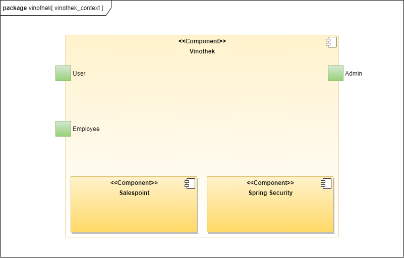

=== 6.2.Top-Level-Architektur
Top-Level-Ansicht des Systems.
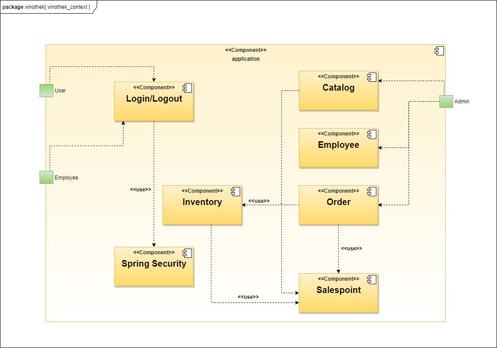

***
== 7.Anwendungsfälle
Dieser Abschnitt gibt einen Überblick über die Anwendungsfälle, die das System unterstützen muss. Diese Anwendungsfälle beschreiben, welche Funktionen das System (meistens) aus Sicht des Kunden bereitstellen muss und welche Akteure beteiligt sind.

=== 7.1.Akteure
Akteure sind Benutzer des Systems oder benachbarter Systeme, die darauf zugreifen. Die folgende Tabelle fasst alle Akteure des Systems zusammen und enthält eine Beschreibung des Akteurs. Abstrakte Akteure (d. H. Ein Akteur, der andere kursiv geschriebene Akteure gruppiert) werden zum Verallgemeinern und Gruppieren verwendet.

// See http://asciidoctor.org/docs/user-manual/#tables
[options="header"]
[cols="1,4"]
|===
|Name                       |Description
|User                       |Repräsentativ für jede Person, die interagiert und mit dem System interagiert, unabhängig davon, ob sie authentifiziert ist oder nicht.
|Employee                   |Jeder registrierte (und authentifizierte) Benutzer, der die Rolle "Employee" hat. Er hat ein Konto, und interagiert mit dem System,
                              aber kann  nicht ein paar Aufgabe tun.
|Admin                      |Jeder registrierte (und authentifizierte) Benutzer, der die Rolle "BOSS" hat. Ist für die Verwaltung der Anwendung verantwortlich.
|===

=== 7.2.Überblick Anwendungsfalldiagramm
[[Use_Case_Diagram]]
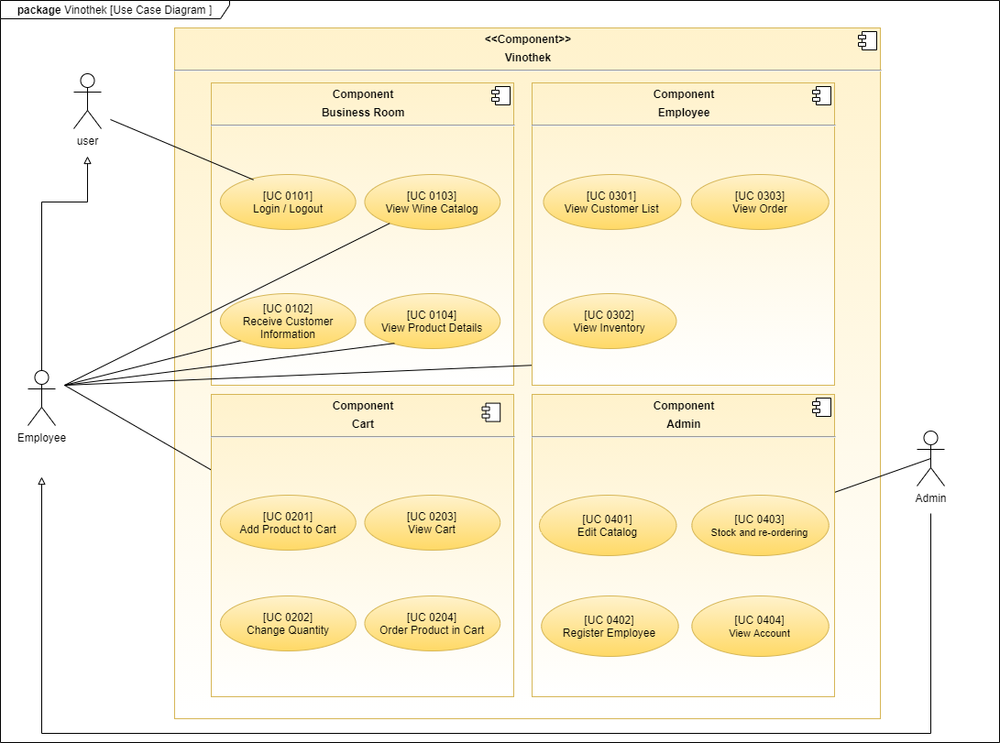

=== 7.3.Anwendungsfallbeschreibungen
In diesem Abschnitt werden die im Anwendungsfalldiagramm gezeigten Anwendungsfälle ausführlich beschrieben.

==== Login / Logout

[cols="1h, 3"]
[[UC0101]]
|===
|ID                         |**<<UC0101>>**
|Name                       |Login / Logout
|Beschreibung               |Ein Benutzer muss sich beim System anmelden (authentifizieren) können, um auf weitere Funktionen zugreifen zu können. Dieser Vorgang muss durch Abmelden rückgängig gemacht werden.
|Akteure                    |User
|Trigger                    a|
Loing: Der Benutzer möchte durch Anmelden auf "versteckte" Funktionen zugreifen.
Logout: Der Benutzer möchte durch Anmelden auf "versteckte" Funktionen zugreifen.
|Vorbedienung(en)           a|
Login: Benutzer ist noch nicht authentifiziert.
Logout: Benutzer ist authentifiziert.
|Erweiterungen              | None
|Funktionale Anforderungen  | <<F0020>>
|===

==== Receive Customer Information

[cols="1h, 3"]
[[UC0102]]
|===
|ID                         |**<<UC0102>>**
|Name                       |Receive Customer Information
|Beschreibung               |Ein Mitarbeiter der Vinothek muss die Information von einem Kunden, der Wines bestellt, speichen zur nächsten Bestellung oder usw.
|Akteure                    |Empoyee
|Trigger                    |Mitarbeiter schreibt die Information von einem Kunden, dann speichern.
|Vorbedienung(en)           |None
|Wesentliche Schritte       a|
1.	Mitarbeiter klickt auf das Navigationselement "Customer".
2.	Mitarbeiter schreibt die Infomation, und speichern.
|Erweiterungen              | -
|Funktionale Anforderungen  | <<F0300>> <<F0301>>
|===

==== View Wine Catalog

[cols="1h, 3"]
[[UC0103]]
|===
|ID                         |**<<UC0103>>**
|Name                       |View Wine Catalog
|Beschreibung               |Ein Mitarbeiter der Vinothek muss auf den Katalog zugreifen können, in dem alle angebotenen Weine angezeigt werden. Der Katalog muss einen Namen und einen Preis für Wein enthalten.
|Akteure                    |Empoyee
|Trigger                    |Zugriff auf das Navigationselement, das für die Anzeige des Katalogs verantwortlich ist.
|Vorbedienung(en)           |None
|Wesentliche Schritte       a|
1.	Mitarbeiter klickt auf das Navigationselement "Weinkatalog".
2.	Dem Mitarbeiter werden alle Weine der ausgewählten Kategorie angezeigt.
|Erweiterungen              | -
|Funktionale Anforderungen  | <<F0110>> <<F0111>> <<F0112>> <<F0113>> <<F0114>>
|===

[[sequence_diagram_view_catalog]]
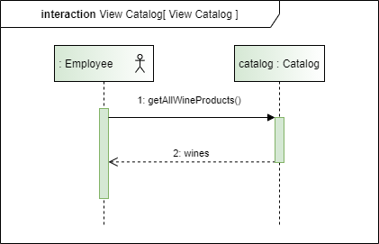

==== View Product Details

[cols="1h, 3"]
[[UC0104]]
|===
|ID                         |**<<UC0104>>**
|Name                       |View Product Details
|Beschreibung               |Ein Mitarbeiter muss in der Lage sein, die Details eines Weins auf einer zusätzlichen Seite anzuzeigen.
|Akteure                    |Empoyee
|Trigger                    |Der Mitarbeiter zeigt den Katalog an und drückt auf einen Eintrag, um die Details des Weins anzuzeigen.
|Vorbedienung(en)           |Der Mitarbeiter zeigt den Katalog an.
|Wesentliche Schritte       a|
1.	Ein Mitarbeiter drückt auf einen angezeigten Eintrag des Katalogs (Wein).
2.	Einem Mitarbeiter werden die Details der ausgewählten Wein angezeigt.
|Erweiterungen              | -
|Funktionale Anforderungen  | <<F0115>>
|===

[[sequence_diagram_view_product_details]]
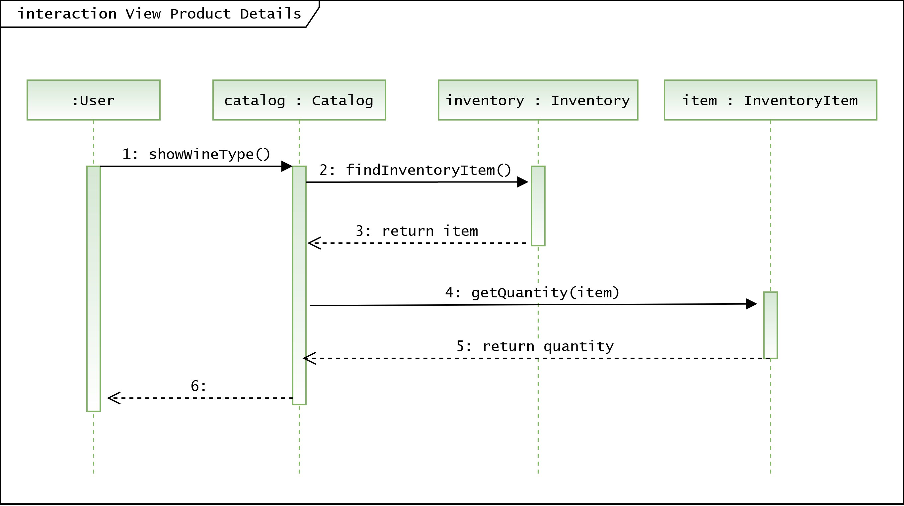

==== Add Product to Cart

[cols="1h, 3"]
[[UC0201]]
|===
|ID                         |**<<UC0201>>**
|Name                       |Add Product to Cart
|Beschreibung               |Ein Mitarbeiter muss in der Lage sein, einen Wein in seinen Einkaufswagen zu legen.
|Akteure                    |Empoyee
|Trigger                    |Ein Mitarbeiter zeigt die Detailseite einer Wine an und möchte sie in seinen Warenkorb legen.
|Vorbedienung(en)           a|
1.	Der Akteur hat sich beim System authentifiziert (d. H. Ist ein registrierter Benutzer).
2.	Der Akteur zeigt die Detailseite einer Wine an.
|Wesentliche Schritte       a|
1.	Der Akteur gibt eine gewünschte Menge für die ausgewählte Wine ein (1..die Menge in der Lage).
2.	Der Akteuer drückt "zum Warenkorb schaffen".
3.	Die Wine wird mit der ausgewählten Menge in den Warenkorb gelegt.
|Erweiterungen              | -
|Funktionale Anforderungen  | <<F0200>>  <<F0201>>
|===

[[sequence_diagram_add_product_to_cart]]
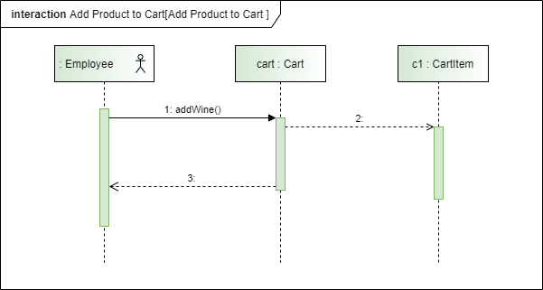

==== Change Quantity

[cols="1h, 3"]
[[UC0202]]
|===
|ID                         |**<<UC0202>>**
|Name                       |Change Quantity
|Beschreibung               |Die Menge des ausgewählten Weins kann geändert werden.
|Akteure                    |Empoyee
|Trigger                    |Ein Mitarbeiter möchte die Menge des ausgewählten Weins in seinen Warenkorb ändern.
|Vorbedienung(en)           |Der Mitarbeiter hat mindestens einen Artikel in seinen Warenkorb gelegt.
|Wesentliche Schritte       a|
1.	Der Akteur drückt "Warenkorb" in der Navigationsleiste.
2.	Der Akteur ändert die Menge eines Wines.
|Erweiterungen              | -
|Funktionale Anforderungen  | <<F0211>>
|===

==== View Cart

[cols="1h, 3"]
[[UC0203]]
|===
|ID                         |**<<UC0203>>**
|Name                       |View Cart
|Beschreibung               |Ein Mitarbeiter muss in der Lage sein, den Inhalt seines Einkaufswagens und den Gesamtpreis seiner Wahl anzuzeigen.
|Akteure                    |Empoyee
|Trigger                    |Der Akteur drückt "Warenkorb" in der Navigationsleiste.
|Vorbedienung(en)           |
|Wesentliche Schritte       a|
1.	Der Akteur drückt "Warenkorb" in der Navigationsleiste.
2.	Dem Akteur wird der Inhalt seines Wagens sowie der Gesamtpreis angezeigt.
|Erweiterungen              | -
|Funktionale Anforderungen  | <<F0210>>
|===

==== Order Products in Cart

[cols="1h, 3"]
[[UC0204]]
|===
|ID                         |**<<UC0204>>**
|Name                       |Order Products in Cart
|Beschreibung               |Ein Mitarbeiter muss den Inhalt des Warenkorbs bestellen können.
|Akteure                    |Empoyee
|Trigger                    |Ein Mitarbeiter bestellt die Weins, die ein Kunde kaufen möchtet.
|Vorbedienung(en)           a|
1.	Der Akteur ist authentifiziert und hat die Rolle "Employee" im System.
2.	Wagen ist nicht leer.
|Wesentliche Schritte       a|
1.	Der Mitarbeiter hat mindestens einen Artikel in seinen Warenkorb gelegt.
2.	Mitarbeiter drückt "Bestellung".
3.	Bestellung wird gegen Lagerbestand geprüft.
4.	Bestellung wird automatisch bezahlt.
5.	Weine werden in der gewählten Menge aus dem Bestand genommen
6.	Bestellung wird archiviert.
|Erweiterungen              | -
|Funktionale Anforderungen  | <<F0220>> <<F0230>> <<F0231>>
|===

==== View Customer List

[cols="1h, 3"]
[[UC0301]]
|===
|ID                         |**<<UC0301>>**
|Name                       |View Customer List
|Beschreibung               |Ein Mitarbeiter sollte in der Lage sein, die gesamte Liste der Kunden der Anwendung anzuzeigen.
|Akteure                    |Empoyee
|Trigger                    |Mitarbeiter wählt "Kunden List" in der Navigationsleiste
|Vorbedienung(en)           |Der Akteur hat sich beim System authentifiziert (d. H. Ist ein registrierter Benutzer).
|Wesentliche Schritte       a|
1.	Der Akteur hat sich beim System authentifiziert (d. H. Ist ein registrierter Benutzer).
2.	Der Aktuer drükt “Kunden List”.
|Erweiterungen              | -
|Funktionale Anforderungen  | <<F0302>> <<F0303>>
|===

==== View Inventory

[cols="1h, 3"]
[[UC0302]]
|===
|ID                         |**<<UC0302>>**
|Name                       |View Inventory
|Beschreibung               |Ein Mitarbeiter muss in der Lage sein, das Inventar einschließlich des aktuellen Bestands anzuzeigen.
|Akteure                    |Empoyee
|Trigger                    |Mitarbeiter wählt "Lager" in der Navigationsleiste
|Vorbedienung(en)           |Der Akteur hat sich beim System authentifiziert (d. H. Ist ein registrierter Benutzer).
|Wesentliche Schritte       a|
1.	Mitarbeiter wählt "Lager" in der Navigationsleiste.
2.	Die vollständige Liste aller Artikel des Inventars und des aktuellen Lagerbestands wird angezeigt
|Erweiterungen              | -
|Funktionale Anforderungen  | <<F0100>> <<F0101>> <<F0102>>
|===

==== View Order

[cols="1h, 3"]
[[UC0303]]
|===
|ID                         |**<<UC0303>>**
|Name                       |View Order
|Beschreibung               |Ein Mitarbeiter muss in der Lage sein, eine Liste der abgeschlossenen Bestellungen anzuzeigen
|Akteure                    |Empoyee
|Trigger                    |Mitarbeiter wählt "Bestellungen" in der Navigationsleiste
|Vorbedienung(en)           |Der Akteur hat sich beim System authentifiziert (d. H. Ist ein registrierter Benutzer).
|Wesentliche Schritte       a|
1.	Mitarbeiter wählt "Sorgen" in der Navigationsleiste
2.	Die vollständige Liste aller abgeschlossenen Bestellungen wird angezeigt
|Erweiterungen              | -
|Funktionale Anforderungen  | <<F0240>> <<F0250>>
|===

[[sequence_diagram_view_orders]]
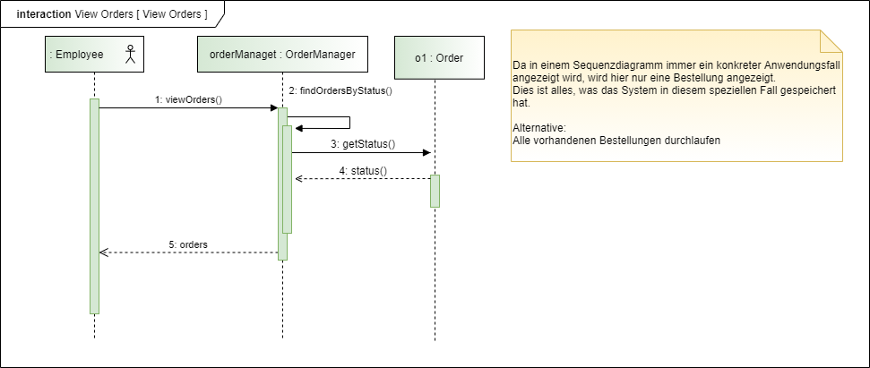

==== Edit Catalog

[cols="1h, 3"]
[[UC0401]]
|===
|ID                         |**<<UC0401>>**
|Name                       |Edit Catalog
|Beschreibung               |Der Adminitstrator kann den Winekatalog ändern.
|Akteure                    |Admin
|Trigger                    |Der Adminitstrator möchte den Winekatalog ändern, indem er auf "Katalog bearbeiten" drückt.
|Vorbedienung(en)           |Der Administrator hat sich beim System authentifiziert (d. H. Ist ein registrierter Benutzer).
|Wesentliche Schritte       a|
1. Der Administrator hat sich beim System authentifiziert (d. H. Ist ein registrierter Benutzer).
2.	Der Administrator drükt “Katalog bearbeitebn”.
3. Er gibt einen Weinname, ein Bild und usw. ein.
4. Wenn eindeutig: Mit den angegebenen Daten wird den Winekatalog geändert.
|Erweiterungen              | -
|Funktionale Anforderungen  | <<F0101>> <<F0120>>
|===

==== Register Employee

[cols="1h, 3"]
[[UC0402]]
|===
|ID                         |**<<UC0402>>**
|Name                       |Register Employee
|Beschreibung               |Der Administrator muss in der Lage sein, ein Konto für einen nicht authentifizierten Benutzer als Mitarbeiter zu erstellen
|Akteure                    |Admin
|Trigger                    |Der Administrator möchte ein Konto für einen Mitarbeiter erstellen, indem er auf "Registrieren" drückt.
|Vorbedienung(en)           |Der Administrator hat sich beim System authentifiziert (d. H. Ist ein registrierter Benutzer).
|Wesentliche Schritte       a|
1. Der Administrator hat sich beim System authentifiziert (d. H. Ist ein registrierter Benutzer).
2. Der Administrator drückt "Registrieren".
3. Er gibt den Benutzernamen, das Passwort und usw. eines Mitarbeiters ein
4. Das System überprüft die Eindeutigkeit des Benutzernamens
5. Wenn eindeutig: Mit den angegebenen Daten wird ein Konto erstellt
6. Andernfalls: Eine Fehlermeldung wird angezeigt
|Erweiterungen              | -
|Funktionale Anforderungen  | <<F0010>> <<F0011>>
|===

==== Stock and re-ordering

[cols="1h, 3"]
[[UC0403]]
|===
|ID                         |**<<UC0403>>**
|Name                       |Stock and re-ordering
|Beschreibung               |Der Administrator muss die Weine, deren Menge in der Lage nicht genug sind, bestellen können.
|Akteure                    |Admin
|Trigger                    |Der Administrator muss die Weine, deren Menge in der Lage nicht genug sind, bestellen können.
|Vorbedienung(en)           a|
1. Der Administrator hat sich beim System authentifiziert (d. H. Ist ein registrierter Benutzer).
2. Es gibt weniger als die Mindestmenge an Wein im Lager.
|Wesentliche Schritte       a|
1.	Der Administrator hat sich beim System authentifiziert (d. H. Ist ein registrierter Benutzer).
2.	Administrator drückt "Bestellung".
3.	Bestellung wird gegen Lagerbestand geprüft.
4.	Bestellung wird automatisch bezahlt.
5.	Weine werden in der gewählten Menge aus dem Bestand genommen
6.	Bestellung wird archiviert.
|Erweiterungen              | -
|Funktionale Anforderungen  | <<F0230>> <<F0231>>
|===

==== View Account

[cols="1h, 3"]
[[UC0404]]
|===
|ID                         |**<<UC0404>>**
|Name                       |View Account
|Beschreibung               |Der Administrator sollte in der Lage sein, die gesamte Liste der Mitarbeiter der Anwendung anzuzeigen.
|Akteure                    |Admin
|Trigger                    |Der Administrator wählt "Mitarbeiter List" in der Navigationsleiste
|Vorbedienung(en)           |Der Administrator hat sich beim System authentifiziert (d. H. Ist ein registrierter Benutzer).
|Wesentliche Schritte       a|
1.	Der Administrator hat sich beim System authentifiziert (d. H. Ist ein registrierter Benutzer).
2.	Der Administrator drükt “Mitarbeiter List”.
|Erweiterungen              | -
|Funktionale Anforderungen  | <<F0030>> <<F0031>>
|===

***
== 8.Funktionale Anforderungen

Die folgenden Tabellen sollen einen Überblick geben über die Anforderungen, die das zu erstellende Programm auf jeden Fall leisten muss (Muss-Kriterien) und Anforderungen, die das Programm leisten können soll, aber für den korrekten Betrieb entbehrlich sind (Kann-Kriterien).

=== 8.1.Muss-Kriterien:

Diese Tabelle enthält

* eine eindeutige Kennung der Anforderung (ID)
* die aktuelle Version der Anforderung
* eine Kurzbezeichnung der Anforderung
* eine genaue Beschreibung der Anforderung

[options="header", cols="2h, 1, 3, 12"]
|===
|ID
|Version
|Name
|Beschreibung

|[[F0010]]<<F0010>>
|v0.1
|Registrierung
a|
Das System wird mit einem standardmäßigen Admin-Zugang ausgeliefert. Weitere Benutzerkonten sollen jedoch von jedem angelegt werden können. Dafür werden folgende Informationen benötigt:

* Vorname
* Name
* Benutzername
* Passwort
* Rechte (Mitarbeiter oder Admin)

|[[F0011]]<<F0011>>
|v0.2
|Registrierung überprüfen
a|
Das System soll bei der Registrierung die eingegebenen Daten überprüfen. Die Einzigartigkeit des Benutzernamens muss garantiert werden.

|[[F0020]]<<F0020>>
|v0.2
|Login
a|
Das System soll sicherstellen, dass nur Mitarbeiter auf das System zugreifen können, indem sich diese mit deren Benutzername und Passwort anmelden müssen.

|[[F0030]]<<F0030>>
|v0.8
|Liste registrierter Mitarbeiter anzeigen
a|
Das System soll eine Liste von registrierten Benutzern mit deren vollständigen Namen und deren Rechten anzeigen.

|[[F0031]]<<F0031>>
|v0.8
|Mitarbeiterliste bearbeiten
a|
Das System soll Admins die Möglichkeit geben, die Mitarbeiter zu bearbeiten und einzelne Mitarbeiter zu entfernen.

|[[F0100]]<<F0100>>
|v0.2
|Lagerbestand
a|
Das System soll den Lagerbestand der einzelnen Weine aus dem Katalog persistent speichern können.

|[[F0101]]<<F0101>>
|v0.2
|Lagerbestand ändern
a|
Das System soll es ermöglichen, den Lagerbestand an Weinen verringern und erhöhen können.

|[[F0102]]<<F0102>>
|v0.2
|Lagerbestand ansehen
a|
Das System soll es den Mitarbeitern ermöglichen, den Lagerbestand der einzelnen Weine einzusehen.

|[[F0110]]<<F0110>>
|v0.1
|Katalog
a|
Das System soll im Katalog jeden Wein mit seinen Eigenschaften abspeichern. Jeder im Katalog gelistete Wein soll sich im Lagerbestand befinden können und sich ggf. nachbestellen lassen.

|[[F0111]]<<F0111>>
|v0.2
|Katalog ansehen
a|
Das System soll die Mitarbeiter die Inhalte des Katalogs ansehen lassen.

|[[F0112]]<<F0112>>
|v0.2
|Katalog durchsuchen
a|
Das System soll den Mitarbeitern die Möglichkeit bieten, den Katalog nach dem Namen eines bestimmten Weins zu durchsuchen.

|[[F0113]]<<F0113>>
|v0.2
|Katalog filtern
a|
Das System soll den Mitarbeitern die Möglichkeit bieten, den Katalog nach bestimmten Weinen zu filtern (z.B. nach Jahrgang, Art, etc.).

|[[F0114]]<<F0114>>
|v0.2
|Katalog sortieren
a|
Das System soll es den Mitarbeitern ermöglichen, den Katalog nach bestimmten Merkmalen zu sortieren (z.B. Preis).

|[[F0115]]<<F0115>>
|v0.2
|Katalog-Detailansicht aufrufen
a|
Das System soll zu jedem Wein im Katalog eine Detailseite haben, auf der die Eigenschaften des Weins im Detail angezeigt werden sollen.

|[[F0120]]<<F0120>>
|v0.2
|Katalog ändern
a|
Das System soll es den Admins ermöglichen, Weine aus dem Katalog entfernen und hinzufügen können.

|[[F0200]]<<F0200>>
|v0.2
|Warenkorb
a|
Das System soll jedem Mitarbeiter einen Warenkorb zur Verfügung, in dem die vom Kunden ausgewählten Artikel temporär gespeichert werden sollen.

|[[F0201]]<<F0201>>
|v0.2
|Artikel in den Warenkorb legen
a|
Das System soll es den Mitarbeitern ermöglichen, Artikel aus dem Katalog direkt für die Kunden in den Warenkorb zu legen.

|[[F0210]]<<F0210>>
|v0.2
|Warenkorb ansehen
a|
Das System soll es den Mitarbeitern ermöglichen, sich den Warenkorb anzusehen. Dort soll aufgelistet werden:

* Name des Weins
* gewählte Anzahl	
* Preis für den einzelnen Wein
* Gesamtpreis des Warenkorbs

|[[F0211]]<<F0211>>
|v0.2
|Warenkorb ändern
a|
Das System soll es den Mitarbeitern ermöglichen, die Anzahl der gewünschten Weine im Warenkorb zu erhöhen oder zu verringern. Außerdem soll es möglich sein, einen Wein gänzlich aus dem Warenkorb zu entfernen.

|[[F0220]]<<F0220>>
|v0.2
|Artikel im Warenkorb kaufen
a|
Das System soll es den Mitarbeitern ermöglichen, die von den Kunden gewählten Artikel im Warenkorb zu kaufen. 

Je nachdem, ob ein Kunde ein Neukunde oder Bestandskunde ist, soll dieser sich registrieren ([[F0301]]<<F0301>>) bzw. sich mit der bereits bekannten E-Mail-Adresse identifizieren.

Beim Kaufversuch soll die potentielle Bestellung validiert werden ([[F0230]]<<F0230>>). Ist der Lagerbestand ausreichend, soll eine Bestellung erstellt werden ([[F0241]]<<F0241>>). Andernfalls soll die Bestellung auf die vorhandenen und die fehlenden Artikel aufgesplittet werden, die fehlenden Artikel müssen nachbestellt werden ([[F0231]]<<F0231>>).

|[[F0230]]<<F0230>>
|v0.2
|Ausreichende Lagerbestände überprüfen
a|
Das System soll fähig sein  festzustellen, ob der Lagerbestand eines bestimmten Produkts mit der gewünschten Menge übereinstimmt.

Stellt das System fest, dass der Lagerbestand geringer als die gewünschte Menge ist, sollen die fehlenden Artikel nachbestellt werden ([[F0231]]<<F0231>>).

Das System soll außerdem, wenn nach einem Kauf die festgelegte Mindestanzahl an Lagerbeständen eines Artikel unterschritten wird, eine Warnung ausgeben und eine entsprechende Menge an Artikel nachbestellen ([[F0231]]<<F0231>>).

|[[F0231]]<<F0231>>
|v0.2
|Artikel nachbestellen
a|
Das System soll in der Lage sein, die bei der Überprüfung der Lagerbestände ([[F0230]]<<F0230>>) festgestellte fehlende Anzahl an Artikeln automatisch nachzubestellen.

Das System soll weiterhin automatisch Artikel nachbestellen, wenn die Lagerbestände durch einen Kauf unter eine festzulegende Mindestanzahl fallen.

Außerdem soll das System Admins ermöglichen, auch manuell Artikel nachzubestellen.

|[[F0240]]<<F0240>>
|v0.2
|Bestellungen
a|
Das System soll Bestellungen persistent speichern.

|[[F0241]]<<F0241>>
|v0.2
|Bestellung anlegen
a|
Das System soll aus den Inhalten eines Warenkorbes eine Bestellung anlegen.

Eine angelegte Bestellung soll den Status “OFFEN” haben.

|[[F0242]]<<F0242>>
|v0.8
|Bestellung bezahlen
a|
Das System soll es ermöglichen, Bestellungen mit dem Status “OFFEN” mit unterschiedlichen Zahlungsmitteln zu bezahlen.

Nachdem die Bestellung bezahlt wurde, soll die Bestellung den Status “ABGESCHLOSSEN” haben.

|[[F0243]]<<F0243>>
|v0.2
|Bestellung stornieren
a|
Das System soll es ermöglichen, Bestellungen mit dem Status “OFFEN” zu stornieren. Bevor die Stornierung durchgeführt wird, muss dies erneut vom Mitarbeiter bestätigt werden.

Nachdem die Bestellung endgültig storniert wurde, soll die Bestellung den Status “STORNIERT” haben.

|[[F0250]]<<F0250>>
|v0.2
|Abgeschlossene Bestellungen ansehen
a|
Das System soll die Funktionalität bieten, Bestellungen im Zustand “ABGESCHLOSSEN” ([[F0244]]<<F0244>>) anzusehen.

|[[F0300]]<<F0300>>
|v0.2
|Kundenstamm
a|
Das System soll die im Kaufprozess ([[F0220]]<<F0220>>) erfassten Kundendaten persistent speichern können.

|[[F0301]]<<F0301>>
|v0.8
|Neuen Kunden zu Kundenstamm hinzufügen
a|
Das System soll Neukunden zum Kundenstamm hinzufügen, indem diese sich mit folgenden Angaben registrieren:

* Vorname
* Name
* E-Mail-Adresse
* Anschrift

|[[F0302]]<<F0302>>
|v0.2
|Bestandskunde in Kundenstamm finden
a|
Das System soll es ermöglichen, bereits registrierte Kunden anhand ihrer E-Mail-Adresse im Kundenstamm zu finden.

|[[F0303]]<<F0303>>
|v0.2
|Kundenstamm ansehen
a|
Das System soll die Möglichkeit bieten, eine Liste mit allen Kundendaten einzusehen.

|[[F0304]]<<F0304>>
|v0.2
|Kundenstamm verwalten
a|
Das System soll die Möglichkeiten bieten, einzelne Kundendaten zu bearbeiten bzw. aus dem Kundenstamm zu entfernen.

|[[F0400]]<<F0400>>
|v0.2
|Bilanz
a|
Das System soll die Einnahmen von Bestellungen und Ausgaben für Nachbestellungen persistent speichern.

|[[F0401]]<<F0401>>
|v0.2
|Bilanz ansehen
a|
Das System soll aus der Differenz von Einnahmen und Ausgaben eine Bilanz erstellen und anzeigen können

|===

=== 8.2.Kann-Kriterien

Diese Tabelle enthält:

* eine eindeutige Kennung der Anforderung (ID)
* die aktuelle Version der Anforderung
* eine Kurzbezeichnung der Anforderung
* eine genaue Beschreibung der Anforderung

[options="header", cols="2h, 1, 3, 12"]
|===
|ID
|Version
|Name
|Beschreibung

|[[F0031]]<<F0030>>
|v0.1
|Passwort ändern
a|
Das System soll es den Admins zusätzlich ermöglichen, die Passwörter aller Mitarbeiterkonten zu ändern.

|[[F0245]]<<F0245>>
|v0.1
|Bestellungen zeitlich überprüfen
a|
Das System soll, falls eine Bestellung zu lange den Status “OFFEN” hat, ermöglichen, dass:

* Lagerbestand, welcher bereits durch diese Bestellung reduziert wurde, wieder erhöht werden muss
* die Bestellung in den Zustand “STORNIERT” gesetzt wird

|===

***
== 9.Nicht-Funktionale Anforderungen

Dieser Abschnitt wird einen Überblick über die nicht-funktionalen Anforderungen an das Projekt Vinothek geben. Diese Anforderung beschreiben, wie das System funktioniert und innerhalb welcher Grenzen es arbeiten soll.

=== 9.1.Qualitätsziele

Die folgende Tabelle zeigt welche Qualitätsanforderungen in welchem Umfang erfüllt werden müssen. Die erste Spalte führt die Qualitätsanforderungen auf, in den folgenden Spalten zeigt ein “x” deren Priorität. Die zugewiesene Priorität muss bei der konkreten Ausarbeitung der nicht-funktionalen Anforderungen berücksichtigt werden.

1 = nicht wichtig … 5 = sehr wichtig

[options="header", cols="3h, ^1, ^1, ^1, ^1, ^1"]
|===
|Quality Demand           | 1 | 2 | 3 | 4 | 5
|Wartbarkeit          |   |   | x |   | 
|Benutzerfreundlichkeit                |   |   |  |  | x
|Sicherheit                 |   |   |   | x |
|===

=== 9.2.Konkrete Nicht-Funktionale Anforderungen:

Diese Tabelle enthält:

* eine eindeutige Kennung der Anforderung (ID)
* die aktuelle Version der Anforderung
* eine Kurzbezeichnung der Anforderung
* eine genaue Beschreibung der Anforderung

[options="header", cols="2h, 1, 3, 12"]
|===
|ID
|Version
|Name
|Beschreibung

|[[NF0010]]<<NF0010>>
|v0.1
|Verfügbarkeit - Uptime
a|
Das System soll eine Uptime von mindestens 99,5% erreichen.

|[[NF0020]]<<NF0020>>
|v0.1
|Sicherheit - Passwortspeicherung
a|
Passwörter sollen nur als Hashwerte
gespeichert werden, um Datendiebstahl zu verhindern.

|[[NF0030]]<<NF0030>>
|v0.1
|Sicherheit - Datenschutz
a|
Mitarbeiter müssen sich einloggen, um das System zu benutzen, damit Kunden nicht unbeaufsichtigt auf Kundendaten zugreifen können.

|===

***
== 10.GUI Prototyp

In diesem Kapitel soll ein Entwurf der Navigationsmöglichkeiten und Dialoge des Systems erstellt werden.
Idealerweise entsteht auch ein grafischer Prototyp, welcher dem Kunden zeigt, wie sein System visuell umgesetzt werden soll.
Konkrete Absprachen - beispielsweise ob der grafische Prototyp oder die Dialoglandkarte höhere Priorität hat - sind mit dem Kunden zu treffen.

=== 10.1.Überblick: Dialoglandkarte
Erstellen Sie ein Übersichtsdiagramm, das das Zusammenspiel Ihrer Masken zur Laufzeit darstellt. Also mit welchen Aktionen zwischen den Masken navigiert wird.
//Die nachfolgende Abbildung zeigt eine an die Pinnwand gezeichnete Dialoglandkarte. Ihre Karte sollte zusätzlich die Buttons/Funktionen darstellen, mit deren Hilfe Sie zwischen den Masken navigieren.

[[GUI_view_orders]]
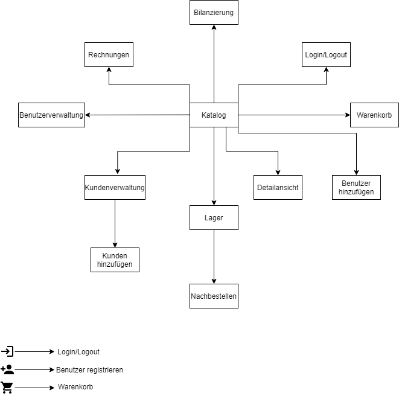
***

=== 10.2.Dialogbeschreibung
Für jeden Dialog:

==== Katalog Ansicht
1. Kurze textuelle Dialogbeschreibung eingefügt: Was soll der jeweilige Dialog? Was kann man damit tun? Überblick?
2. Maskenentwürfe (Screenshot, Mockup)
3. Maskenelemente (Ein/Ausgabefelder, Aktionen wie Buttons, Listen, …)
4. Evtl. Maskendetails, spezielle Widgets

[[GUI_view_orders]]
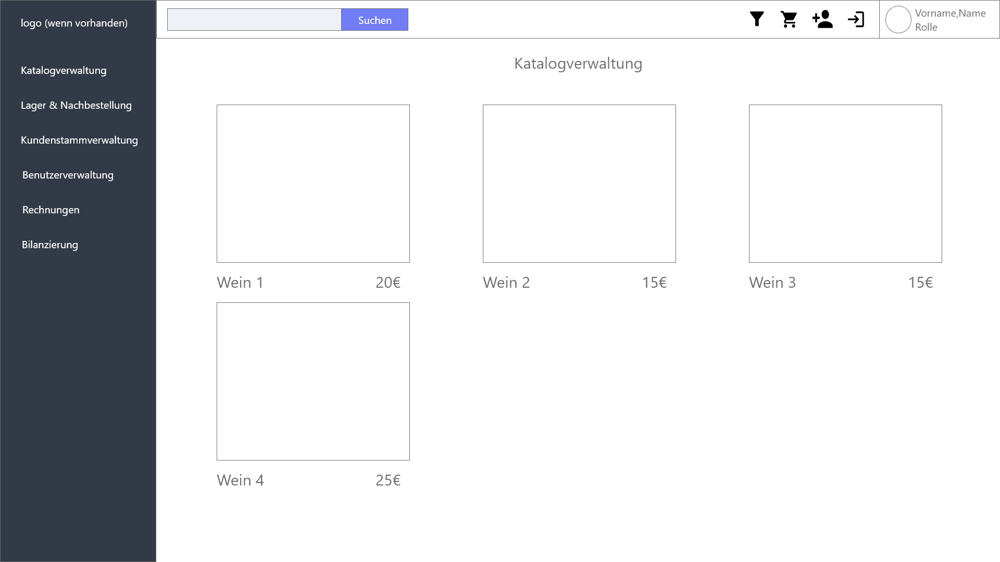
==== Katalog Ansicht
***
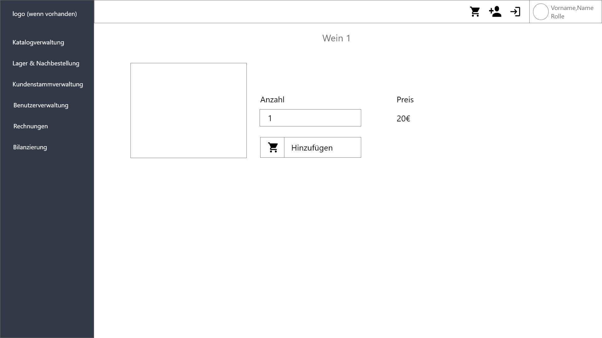
==== Detail Ansicht des Weines
***
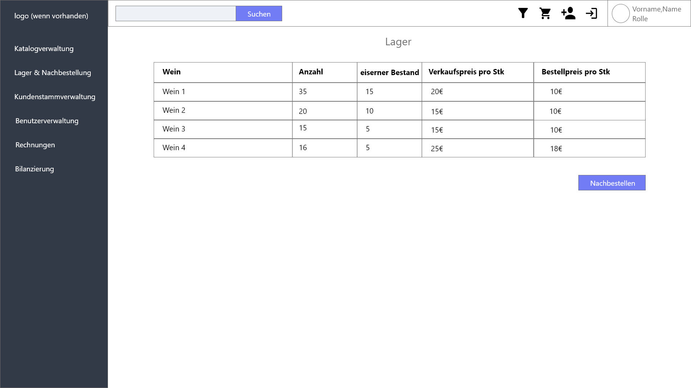

==== Lager Ansicht
***
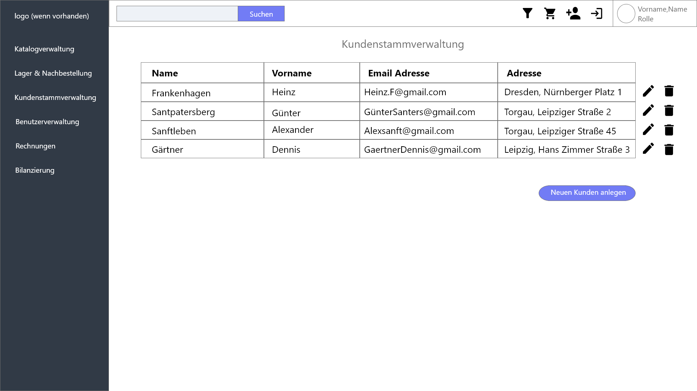

==== Registrierte Kunden
***
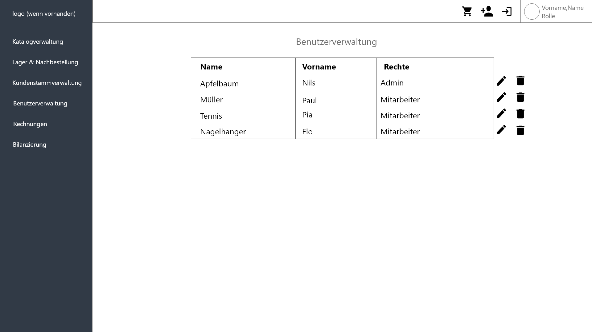
==== Mitarbeiter Liste
***
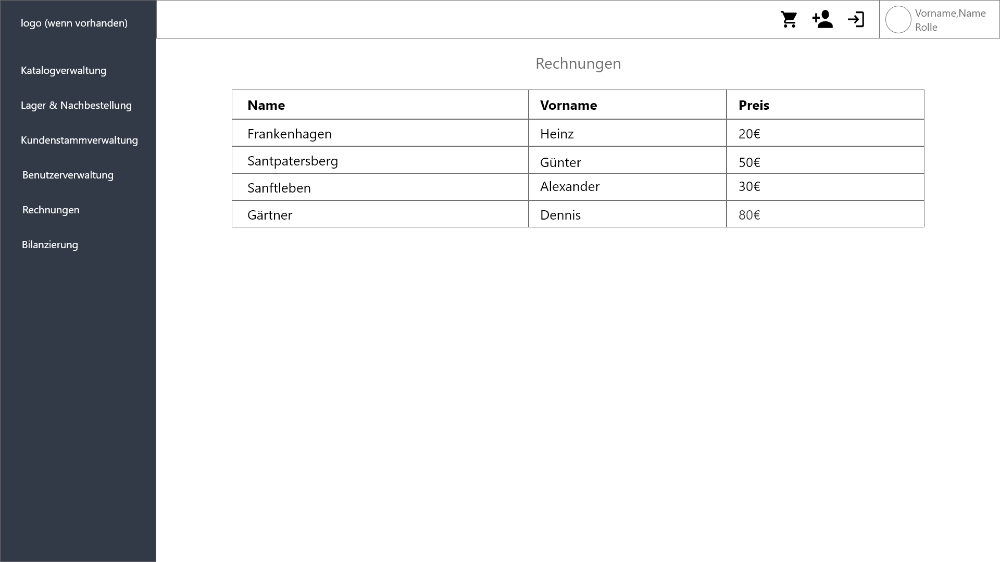
==== Rechnungen
***
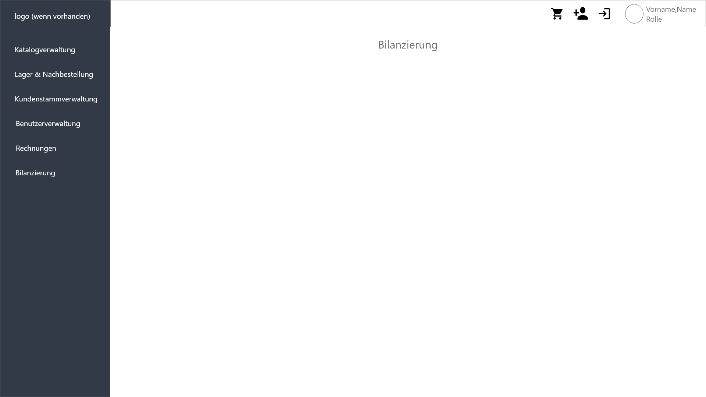
==== Bilanzierung
***
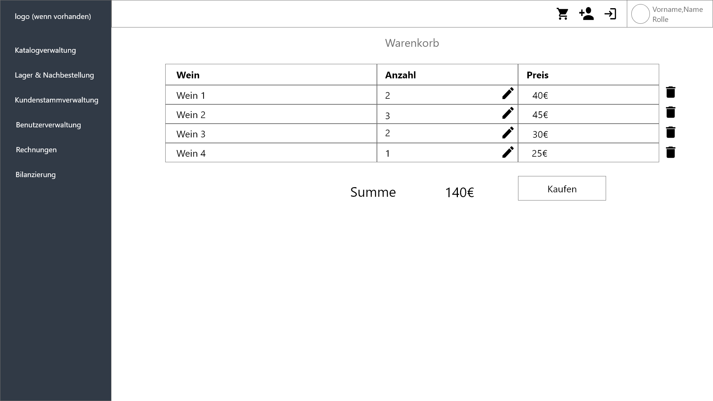
==== Warenkorb
***
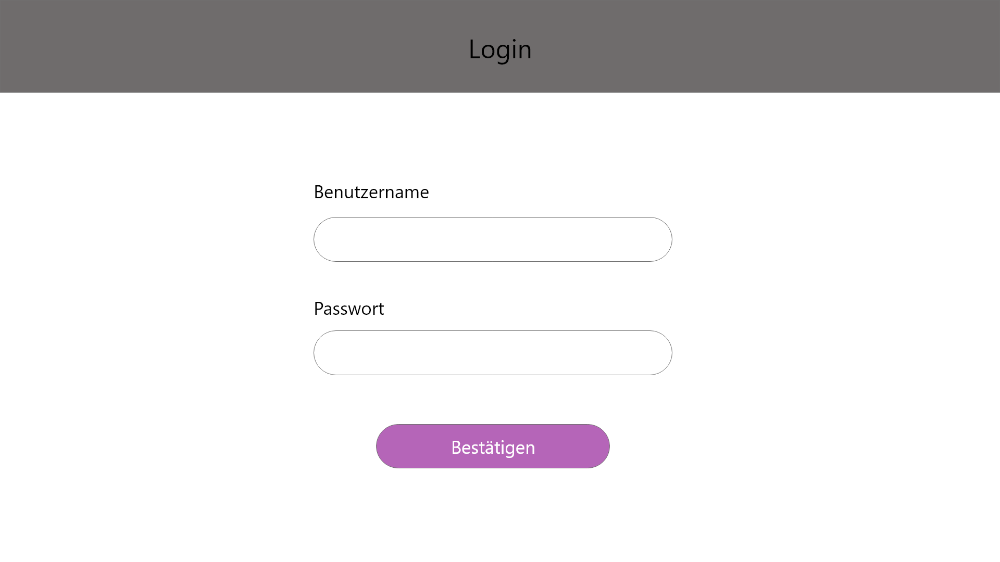
==== Login
***
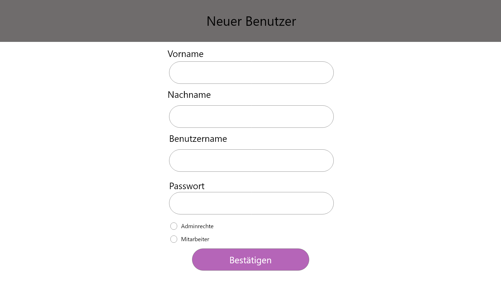
==== Benutzer Registrieren
***
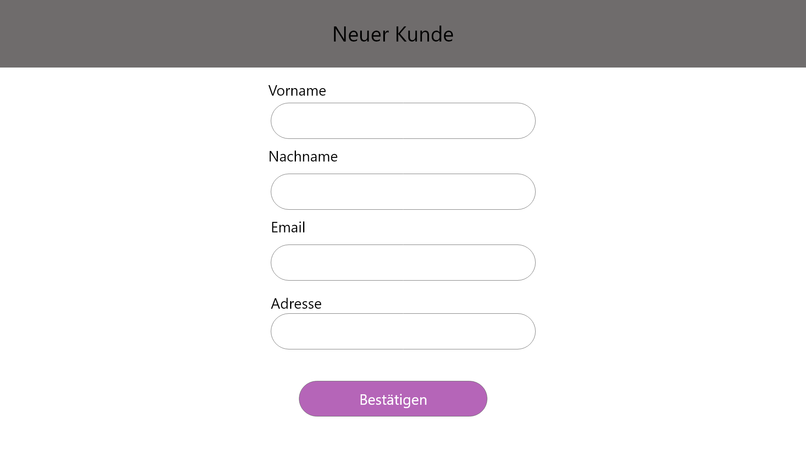
==== Kunden Registrieren

== 11.Datenmodell

=== 11.1.Klassendiagramm
Das (Analyse-) Klassendiagramm soll einen Überblick über die Domäne im Kontext des Systems geben, das im Rahmen dieses Projekts entwickelt werden soll

[[class_diagram]]
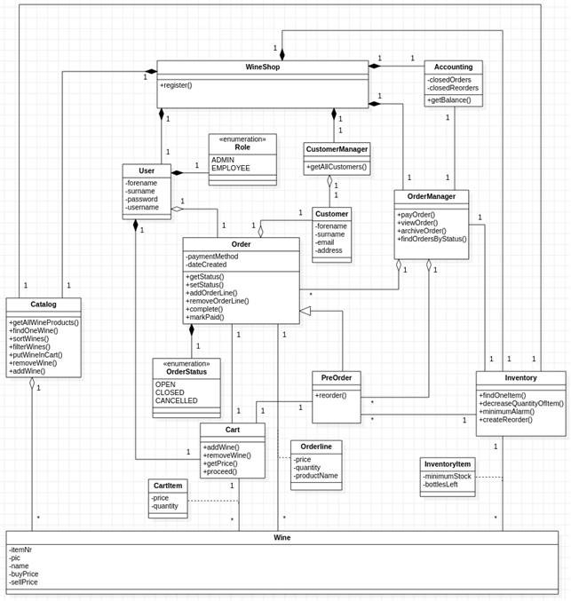

=== 11.2.Klassen und Enumerationen
Die folgende Tabelle gibt einen Überblick über die im Domänenmodell verwendeten Klassen / Aufzählungen. Daher ist dieser Abschnitt eine Teilmenge des Glossars und soll jedem Stakeholder ein gemeinsames Verständnis der zentralen Begriffe und Konzepte der Domäne des Systems vermitteln.

// See http://asciidoctor.org/docs/user-manual/#tables
[options="header"]
[[classes_enumerations]]
|===
|Klasse/Enumeration |Beschreibung
|Wine               |**<<UC0404>>**
|CartItem           |View Account
|Cart               |Der Administrator sollte in der Lage sein, die gesamte Liste der Mitarbeiter der Anwendung anzuzeigen.
|InventoryItem      |Admin
|Inventory          |Der Administrator wählt "Mitarbeiter List" in der Navigationsleiste
|Orderline          |Der Administrator hat sich beim System authentifiziert (d. H. Ist ein registrierter Benutzer).
|Accounting         |Stellt Informationen über alte Bestellungen, alte Nachbestellung und Balanzierung bereit.
|OrderManager       |OrderManager	Verwaltet die Order und speichert die Order in die Buchhaltung ab.
|Preorder           |Erbt von Order. Wenn eine Bestellung durchgeführt werden soll und die Bestellung trennbar in Nachbestellung nötig und Nachbestellung nicht nötig ist, wird für Nachbestellung nötig die Klasse Preorder statt Order benutzt.
|Order              |Klasse, welche eine Bestellung verwaltet und dessen Status ändern kann.
|OrderStatus        |Zustand der Bestellung: OPEN, CLOSED oder CANCELLED.
|CustomerManager    |Kann alle Kundendaten listen.
|Customer           |Customer	Kunde, welcher im System mit seinen Daten für spätere Bestellungen oder Werbeaktionen gespeichert werden soll.
|User               |Benutzer, welcher sich einloggen kann. Je nach Berechtigungsstufe: Admin oder Mitarbeiter.
|Role               |Berechtigungsstufe für User: Admin oder Mitarbeiter.
|WineShop           |WineShop	Zentrale Klasse, worin später alle Hauptobjekte abgelegt werden.
|===

***
== 12.Akzeptanztestfälle
Mithilfe von Akzeptanztests wird geprüft, ob die Software die funktionalen Erwartungen und Anforderungen im Gebrauch erfüllt. Diese sollen und können aus den Anwendungsfallbeschreibungen und den UML-Sequenzdiagrammen abgeleitet werden. D.h., pro (komplexen) Anwendungsfall gibt es typischerweise mindestens ein Sequenzdiagramm (welches ein Szenarium beschreibt). Für jedes Szenarium sollte es einen Akzeptanztestfall geben. Listen Sie alle Akzeptanztestfälle in tabellarischer Form auf.
Jeder Testfall soll mit einer ID versehen werde, um später zwischen den Dokumenten (z.B. im Test-Plan) referenzieren zu können.

[options="header"]
|===
|ID| [[AT0010]] <<AT0010>>
|Use Case                       |[[UC0101]] <<UC0101>>
|Voraussetzung                  |Das System beinhaltet dein Konto
|Event                          |Ein unauthentifizierter Benutzer bekommt den login Screen und meldet sich mit dem bereits existierenden Benutzername "Nils" und dem Passwort "plpkpladj" an
|Erwartetes Ergebnis            |-> Der Benutzer wurde als "Nils" authentifiziert

                                 -> Der Benutzer "Nils" ist in dem System ein Admin und hat auf alle funktionalitäten zugriff

|===

[options="header"]
|===
|ID| [[AT0011]] <<AT0011>>
|Use Case                       |[[UC0101]] <<UC0101>>
|Voraussetzung                  |Ein authentifizierter Benutzer ist gerade angemeldet
|Event                          |Der Benutzer drückt auf Ausloggen
|Erwartetes Ergebnis            |-> Er wird zu einem unauthentifizierten Benutzer

                                ->Er verliert alle funktionalitäten und seine Rolle
|===

[options="header"]
|===
|ID| [[AT0020]] <<AT0020>>
|Use Case                       |[[UC0402]] <<UC0402>>
|Voraussetzung                  |Nur ein Admin kann einen neuen Mitarbeiter oder einen weiteren Admin erstellen
|Event                          |->Name: Test

                                 ->Passwort: 123

                                 -> Checkbox: Mitarbeiter

                                 Auf Bestätigen drücken
|Erwartetes Ergebnis            |Ein neuer Mitarbeiter Account wurde erstellt und dieser kann sich nun anmelden.
|===

[options="header"]
|===
|ID| [[AT0030]] <<AT0030>>
|Use Case                       |[[UC0102]] <<UC0102>>
|Voraussetzung                  |Mitarbeiter nimmt Kunden Daten auf der noch nicht registriert ist
|Event                          |Neuen Kunden erstellen

                                 ->Vorname: "Hans"

                                 ->Nachname: "Lother"

                                 ->Email: "Hansjürgen@gmail.com"

                                 -> Adresse: Lothar Straße 44
|Erwartetes Ergebnis            |Kundendaten werden angelegt
|===

[options="header"]
|===
|ID| [[AT0040]] <<AT0040>>
|Use Case                       |[[UC0103]] <<UC0103>>
|Voraussetzung                  |Ein Mitarbeiter verwendet das System
|Event                          |Mitarbeiter drückt auf Katalogverwaltung
|Erwartetes Ergebnis            |Mitarbeiter bekommt zugriff auf den Katalog
|===

[options="header"]
|===
|ID| [[AT0050]] <<AT0050>>
|Use Case                       |[[UC0104]] <<UC0104>>
|Voraussetzung                  |Ein Mitarbeiter verwendet das System und geht auf Katalogverwaltung ([[AT0040]] <<AT0040>>)
|Event                          |Mitarbeiter drückt in der Katalogübersicht auf "Wein 1"
|Erwartetes Ergebnis            |Es werden die Details vom "Wein 1" angezeigt
|===

[options="header"]
|===
|ID| [[AT0060]] <<AT0060>>
|Use Case                       |[[UC0201]] <<UC0201>>
|Voraussetzung                  |Ein Mitarbeiter verwendet das System und ist auf der Detailansicht des Weines ([[AT0050]] <<AT0050>>)
|Event                          |Mitarbeiter gibt im Anzahl Fenster die zahl "1" ein und geht dann auf "hinzufügen"
|Erwartetes Ergebnis            |Im Warenkorb wurde der gewünschte Wein 1 mal hinzugefügt
|===

[options="header"]
|===
|ID| [[AT0070]] <<AT0070>>
|Use Case                       |[[UC0203]] <<UC0203>>
|Voraussetzung                  |Ein Mitarbeiter verwendet das System
|Event                          |Auf Warenkorb klicken
|Erwartetes Ergebnis            |Mitarbeiter bekommt die Warenkob Ansicht
|===

[options="header"]
|===
|ID| [[AT0071]] <<AT0071>>
|Use Case                       |[[UC0202]] <<UC0202>>
|Voraussetzung                  |Ein Mitarbeiter verwendet das System und ist im Warenkorb ([[AT0070]] <<AT0070>>)
|Event                          |Auf den "bearbeiten" Knopf drücken und die Anzahl von "Wein 1" von 1 auf 2 erhöhen
|Erwartetes Ergebnis            |Die Anzahl von "Wein 1" wurde von 1 auf 2 verändert
|===

[options="header"]
|===
|ID| [[AT0072]] <<AT0072>>
|Use Case                       |[[UC0204]] <<UC0204>>
|Voraussetzung                  |Ein Mitarbeiter verwendet das System, befindet sich im Warenkorb ([[AT0070]] <<AT0070>>) und der Warenkorb beinhaltet mindestens ein Produkt ([[AT0060]] <<AT0060>>)
|Event                          |Mitarbeiter klickt auf den Knopf "Kaufen"
|Erwartetes Ergebnis            |Rechnung wird erstellt und der Kunde hat den gewünschten Wein gekauft
|===

[options="header"]
|===
|ID| [[AT0080]] <<AT0080>>
|Use Case                       |[[UC0301]] <<UC0301>>
|Voraussetzung                  |Ein Mitarbeiter vewendet das System
|Event                          |Mitarbeiter klickt auf "Kundenstammverwaltung"
|Erwartetes Ergebnis            |Es werden alle Kunden angezeigt die Registriert wurden
|===

[options="header"]
|===
|ID| [[AT0090]] <<AT0090>>
|Use Case                       |[[UC0302]] <<UC0302>>
|Voraussetzung                  |Ein Mitarbeiter werwendet das System
|Event                          |Mitarbeiter klickt auf "Lager & Nachbestellung"
|Erwartetes Ergebnis            |Es werden alle items des Inventares angezeigt
|===

[options="header"]
|===
|ID| [[AT0100]] <<AT0100>>
|Use Case                       |[[UC0303]] <<UC0303>>
|Voraussetzung                  |Ein Mitarbeiter verwendet das System
|Event                          |Mitarbeiter klickt auf "Rechnungen"
|Erwartetes Ergebnis            |Es werden alle Rechnungen aufgelistet
|===

[options="header"]
|===
|ID| [[AT0110]] <<AT0110>>
|Use Case                       |[[UC0402]] <<UC0402>>
|Voraussetzung                  |Admin verwendet das System
|Event                          |Admin klickt auf Benutzer Registrieren

                                 ->Vorname: "Andy"

                                 -> Nachname: "Berthold"

                                 -> Benutzername: "Andy"

                                 -> Passwort:   "123"

                                -> Mitarbeiter: check
|Erwartetes Ergebnis            |Ein Mitarbeiter Account mit dem Benutzername "Andy" und dem Passwort "123" wurde erstellt und kann sich nun anmelden
|===

[options="header"]
|===
|ID| [[AT0120]] <<AT0120>>
|Use Case                       |[[UC0403]] <<UC0403>>
|Voraussetzung                  |Admin verwendet das System und ist auf der "Lager & Nachbestellung" Seite ([[AT0090]] <<AT0090>>)
|Event                          |Auf den "Nachbestellen" Knopf drücken und dann eingeben was für ein Wein man Nachbestellen möchte + die Anzahl

                                 -> Wein: "Wein 1"

                                 -> Menge: 20
|Erwartetes Ergebnis            |"Wein 1" wird mit der Menge 20 nachbestellt
|===

[options="header"]
|===
|ID| [[AT0130]] <<AT0130>>
|Use Case                       |[[UC0404]] <<UC0404>>
|Voraussetzung                  |Admin verwendet das System
|Event                          |Admin klickt auf "Benutzerverwaltung"
|Erwartetes Ergebnis            |Alle Benutzer werden aufgelistet
|===

***
== 13.Glossar
Das Glossar enthält eine Liste aller in diesem Projekt verwendeten Wörter und Ausdrücke, für die eine Beschreibung erforderlich ist, um Missverständnisse zwischen den Beteiligten zu vermeiden. Weitere Definitionen der Begriffe finden Sie auch in der Liste der Akteure, in der Liste der Interessensgruppen und im Domänenmodell.

:domain_ref: See <<classes_enumerations, domain overview>>

[options="header", cols="1h, 4"]
[[glossar]]
|===
|Bezeichnung		  |Beschreibung
|Wine 			      |{domain_ref}
|CartItem		      |{domain_ref}
|Cart			        |{domain_ref}
|InventoryItem	  |{domain_ref}
|Inventory		    |{domain_ref}
|Catalog		      |{domain_ref}
|Orderline		    |{domain_ref}
|Accounting		    |{domain_ref}
|OrderManager		  |{domain_ref}
|Preorder		      |{domain_ref}
|Order			      |{domain_ref}
|OrderStatus		  |{domain_ref}
|CustomerManager	|{domain_ref}
|Customer		      |{domain_ref}
|User			        |{domain_ref}
|Role			        |{domain_ref}
|WineShop		      |{domain_ref}
|Login			      |Erfolgreiche Authentifizierung nach Eingabe der korrekten (vorhandenen) Anmeldeinformationen eines Benutzers (Users)
|Registrierung		|Prozess zum Erstellen eines neuen Kontos im System (eine neue Benutzerdarstellung)
|System			      |Allgemeiner Begriff für das Softwaresystem, das während dieses Projekts implementiert werden muss
|Mitarbeiter		  |Synonym für User	
|Auftraggeber	  	|Synonym für den Kunden dieses Projekts (La Bouteille)
|Auftragnehmer		|Verantwortliche für die Implementierung der Software 
|Produkt		      |Abstraktion eines Weins. Jeder Wein ist ein Produkt
|===

***
== 14.Offene Punkte
Offene Punkte werden entweder direkt in der Spezifikation notiert. Wenn das Pflichtenheft zum finalen Review vorgelegt wird, sollte es keine offenen Punkte mehr geben.
