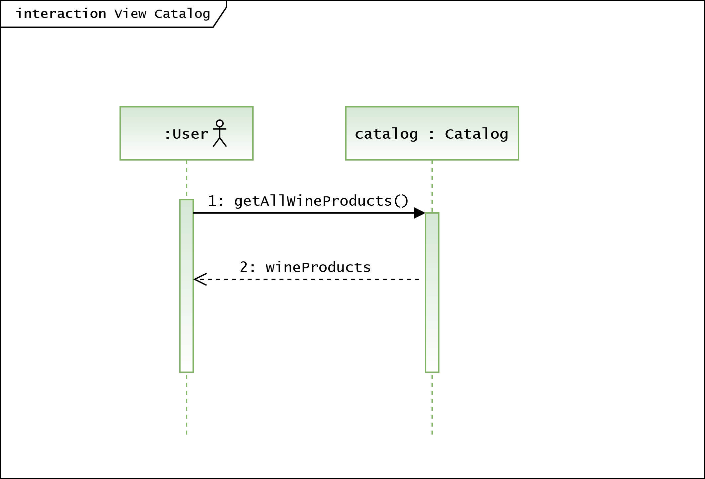

= Pflichtenheft
:project_name: Projektname
== __{project_name}__

[options="header"]
[cols="1, 1, 1, 1, 4"]
|===
|Version | Status      | Bearbeitungsdatum   | Autoren(en) |  Vermerk
|0.1     | In Arbeit   | 10.10.2020          | Autor       | Initiale Version
|===

== Inhaltsverzeichnis
Dieses Dokument benötigt ein Inhaltsverzeichnis. Es existieren mehrere Einbindungsmöglichkeiten.

== Zusammenfassung
Eine kurze Beschreibung des Dokuments. Wenige Absätze.

== Aufgabenstellung und Zielsetzung
Text aus Aufgabenstellung kopieren und ggfs. präzisieren.

Unsere Vinothek (WineShop) hat zwei Typen von Benutzer:innen (User): Angestellte (Employee) und Chef (Admin) mit unterschiedlichen Verantwortlichkeiten.

Jede Benutzer:in darf auf den Katalog (Catalogue) zugreifen, allerdings dürfen Angestellten keine Änderungen daran vornehmen. Der Katalog beinhaltet Informationen über alle Produkte (Wine) des Weingeschäfts. Jeder Weinsorte wird ein Bild (pic) zugeordnet mit zahlreichen Informationen über Artikelnummer (itemNr), Name (name), Sorte (type), Jahrgang (vintage), Herkunft (origin), Geschichte (history), Geschmack (flavour), Preis (price), verbleibende Anzahl im Lager (bottles_left).

Jede Kund:in  (Customer) besitzt genau ein Konto in unserem System. Unter diesem Konto werden folgende Kundedaten gespeichert: Kunden-ID (customer_ID), Vorname (forename), Zuname (surname), Geburtsdatum (dob), E-Mail-Adresse (email). Kund:in darf zum Zeitpunkt der Kontoerstellung nicht minderjährig (not_underage) sein.

Shopping-Modus:

Unsere Kund:innen werden in der nächsten Zukunft keinen Zugang zu unserem Shop haben, Einkäufe werden von Angestellten erfasst. Bevor man shoppen kann, muss man zuerst die Kund:in aus der Kundenliste (list_of_customers) auswählen, bzw. ein neues Konto erstellen(add_customer).

Im Shopping-Modus bei jeder Ware im Katalog erscheinen jeweils zwei Felder: Anzahl (quantity) und "In den Warenkorb" (add_to_basket). Jede Ware kann zum Warenkorb hinzugefügt werden, egal ob sie vorhanden ist oder nicht.

Im Warenkorb-Modus kann die Anzahl jeder Ware geändert werden (edit), jede einzelne Ware (remove) bzw. der gesamte Warenkorb (empty) können gelöscht werden.

Wenn die Kund:in fertig mit dem Einkaufen ist, klickt die Verkäufer:in auf "Zur Kasse gehen". Im neuen Fenster wird die Kund:in aus der Kundenliste ausgewählt. Die möglichen Zahlungsarten (payment_method) sind Bargeld (cash) oder Kreditkarte (credit_card). Danach klickt man auf "Bezahlt" (Orders.add). 

Falls eine Bestellung aus nicht vorhandenen Waren besteht (Order.status: opened),ist die fehlende Ware nachzubestellen (reorder). Die Kund:in wird per E-Mail informiert, sobald die Ware eingetroffen ist (Order.status: closed).

Unsere Produkte werden im Weinlager (Inventory) aufbewahrt. Jeder Weinsorte (InventoryItem) wird die Anzahl (quantity) und der Status (reordering) zugespeichert. Jede Weinsorte kann nachbestellt (reorder) werden. Es darf pro Weinsorte gleichzeitig maximal eine Nachbestellung laufen.

Insbesondere ergänzen, welche Ziele mit dem Abschluss des Projektes erreicht werden sollen.

== Produktnutzung
In welchem Kontext soll das System später genutzt werden? Welche Rahmenbedingungen gelten?
Zusätzlich kurze Einleitung für fachfremde Personen

== Interessensgruppen (Stakeholders)
Welche realen und juristischen Personen(-gruppen) haben Einfluss auf die Anforderungen im Projekt?

== Systemgrenze und Top-Level-Architektur

=== Kontextdiagramm
Das Kontextdiagramm zeigt das geplante Software-System in seiner Umgebung. Zur Umgebung gehören alle Nutzergruppen des Systems und Nachbarsysteme. Die Grafik kann auch informell gehalten sein. Überlegen Sie sich dann geeignete Symbole. Die Grafik kann beispielsweise mit Visio erstellt werden. Wenn nötig, erläutern Sie diese Grafik.

=== Top-Level-Architektur
Dokumentieren Sie ihre Top-Level-Architektur mit Hilfe eines Komponentendiagramm.

== Anwendungsfälle

=== Akteure

Akteure sind die Benutzer des Software-Systems oder Nachbarsysteme, welche darauf zugreifen. Dokumentieren Sie die Akteure in einer Tabelle. Diese Tabelle gibt einen Überblick über die Akteure und beschreibt sie kurz. Die Tabelle hat also mindestens zwei Spalten (Akteur Name und Kommentar).
Weitere relevante Spalten können bei Bedarf ergänzt werden.

// See http://asciidoctor.org/docs/user-manual/#tables
[options="header"]
[cols="1,4"]
|===
|Name |Beschreibung
|...  |...
|===

=== Überblick Anwendungsfalldiagramm
Anwendungsfall-Diagramm, das alle Anwendungsfälle und alle Akteure darstellt

=== Anwendungsfallbeschreibungen
Dieser Unterabschnitt beschreibt die Anwendungsfälle. In dieser Beschreibung müssen noch nicht alle Sonderfälle und Varianten berücksichtigt werden. Schwerpunkt ist es, die wichtigsten Anwendungsfälle des Systems zu finden. Wichtig sind solche Anwendungsfälle, die für den Auftraggeber, den Nutzer den größten Nutzen bringen.
Für komplexere Anwendungsfälle ein UML-Sequenzdiagramm ergänzen.
Einfache Anwendungsfälle mit einem Absatz beschreiben.
Die typischen Anwendungsfälle (Anlegen, Ändern, Löschen) können zu einem einzigen zusammengefasst werden.

[cols="1h, 3"]
[[UC0010]]
|===
|ID                         |**<<UC00XY>>**
|Name                       |ViewCatalog
|Beschreibung               |Hier bekommt man Informationen über alle Weinsorten, die sich im Katalog befinden.
|Akteure                    |User (Employee & Admin)
|Trigger                    |
_Katalog_: Benutzer:in möchte den Katalog aufrufen.

|Vorbedienung(en)           a|
_Katalog_: Benutzer:in ist angemeldet.

|Essential Steps           a|keine

|Extensions                 |-
|Functional Requirements    |<<F00XY>>
|===

[[sequence_diagram_view_catalog]]

[cols="1h, 3"]
[[UC0010]]
|===
|ID                         |**<<UC00XY>>**
|Name                       |ViewDetails
|Beschreibung               |Hier bekommt man Informationen über die Weinsorten bzw. Verfügbarkeit auf dem Lager.
|Akteure                    |User
|Trigger                    |
_Details_: Benutzer:in möchte Details über eine Weinsorte erfahren.

_Zurück_: Benutzer:in befindet sich im Beschreibungsmenü und möchte zurück zur Produktliste zurückkehren.
|Vorbedienung(en)           a|
_Details_: Benutzer:in befindet sich im Katalog-Menü

_Zurück_: Benutzer:in befindet sich im Beschreibungsmodus
|Essential Steps           a|
keine

|Extensions                 |-
|Functional Requirements    |<<F00XY>>
|===

== Funktionale Anforderungen

=== Muss-Kriterien
Was das zu erstellende Programm auf alle Fälle leisten muss.

=== Kann-Kriterien
Anforderungen die das Programm leisten können soll, aber für den korrekten Betrieb entbehrlich sind.

== Nicht-Funktionale Anforderungen

=== Qualitätsziele

Dokumentieren Sie in einer Tabelle die Qualitätsziele, welche das System erreichen soll, sowie deren Priorität.

=== Konkrete Nicht-Funktionale Anforderungen

Beschreiben Sie Nicht-Funktionale Anforderungen, welche dazu dienen, die zuvor definierten Qualitätsziele zu erreichen.
Achten Sie darauf, dass deren Erfüllung (mindestens theoretisch) messbar sein muss.

== GUI Prototyp

In diesem Kapitel soll ein Entwurf der Navigationsmöglichkeiten und Dialoge des Systems erstellt werden.
Idealerweise entsteht auch ein grafischer Prototyp, welcher dem Kunden zeigt, wie sein System visuell umgesetzt werden soll.
Konkrete Absprachen - beispielsweise ob der grafische Prototyp oder die Dialoglandkarte höhere Priorität hat - sind mit dem Kunden zu treffen.

=== Überblick: Dialoglandkarte
Erstellen Sie ein Übersichtsdiagramm, das das Zusammenspiel Ihrer Masken zur Laufzeit darstellt. Also mit welchen Aktionen zwischen den Masken navigiert wird.
//Die nachfolgende Abbildung zeigt eine an die Pinnwand gezeichnete Dialoglandkarte. Ihre Karte sollte zusätzlich die Buttons/Funktionen darstellen, mit deren Hilfe Sie zwischen den Masken navigieren.

=== Dialogbeschreibung
Für jeden Dialog:

1. Kurze textuelle Dialogbeschreibung eingefügt: Was soll der jeweilige Dialog? Was kann man damit tun? Überblick?
2. Maskenentwürfe (Screenshot, Mockup)
3. Maskenelemente (Ein/Ausgabefelder, Aktionen wie Buttons, Listen, …)
4. Evtl. Maskendetails, spezielle Widgets

== Datenmodell

=== Überblick: Klassendiagramm
UML-Analyseklassendiagramm

=== Klassen und Enumerationen
Dieser Abschnitt stellt eine Vereinigung von Glossar und der Beschreibung von Klassen/Enumerationen dar. Jede Klasse und Enumeration wird in Form eines Glossars textuell beschrieben. Zusätzlich werden eventuellen Konsistenz- und Formatierungsregeln aufgeführt.

// See http://asciidoctor.org/docs/user-manual/#tables
[options="header"]
|===
|Klasse/Enumeration |Beschreibung |
|…                  |…            |
|===

== Akzeptanztestfälle
Mithilfe von Akzeptanztests wird geprüft, ob die Software die funktionalen Erwartungen und Anforderungen im Gebrauch erfüllt. Diese sollen und können aus den Anwendungsfallbeschreibungen und den UML-Sequenzdiagrammen abgeleitet werden. D.h., pro (komplexen) Anwendungsfall gibt es typischerweise mindestens ein Sequenzdiagramm (welches ein Szenarium beschreibt). Für jedes Szenarium sollte es einen Akzeptanztestfall geben. Listen Sie alle Akzeptanztestfälle in tabellarischer Form auf.
Jeder Testfall soll mit einer ID versehen werde, um später zwischen den Dokumenten (z.B. im Test-Plan) referenzieren zu können.

== Glossar
Sämtliche Begriffe, die innerhalb des Projektes verwendet werden und deren gemeinsames Verständnis aller beteiligten Stakeholder essentiell ist, sollten hier aufgeführt werden.
Insbesondere Begriffe der zu implementierenden Domäne wurden bereits beschrieben, jedoch gibt es meist mehr Begriffe, die einer Beschreibung bedürfen. +
Beispiel: Was bedeutet "Kunde"? Ein Nutzer des Systems? Der Kunde des Projektes (Auftraggeber)?

== Offene Punkte
Offene Punkte werden entweder direkt in der Spezifikation notiert. Wenn das Pflichtenheft zum finalen Review vorgelegt wird, sollte es keine offenen Punkte mehr geben.
